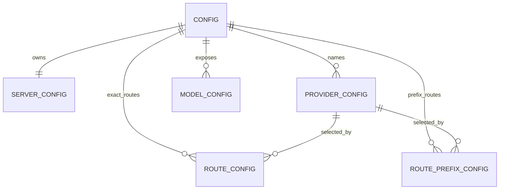
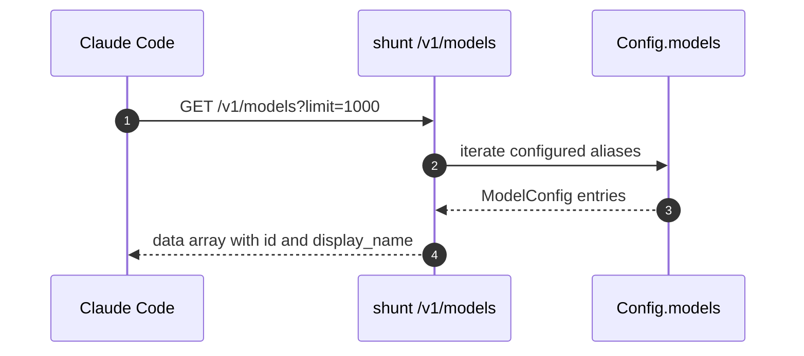

## Overview

Configuration exists to keep shunt generic: new upstreams are provider table entries, not code changes, and routing is a data problem expressed as exact model routes, prefix routes, and a default provider. `Config::load` merges built-in defaults, a TOML file, and `SHUNT_` environment overrides before `validate` checks bind addresses, provider URLs, auth requirements, and provider references [src/config.rs:185-194](https://github.com/chatbot-pf/shunt/blob/main/src/config.rs#L185-L194) [src/config.rs:196-242](https://github.com/chatbot-pf/shunt/blob/main/src/config.rs#L196-L242).

| Area | Responsibility | Key file | Source |
|---|---|---|---|
| Built-in defaults | Seeds `anthropic`, `openai`, and `codex` providers | `src/config.rs` | [src/config.rs:142-183](https://github.com/chatbot-pf/shunt/blob/main/src/config.rs#L142-L183) |
| TOML example | Documents server, providers, routes, aliases | `shunt.toml.example` | [shunt.toml.example:1-134](https://github.com/chatbot-pf/shunt/blob/main/shunt.toml.example#L1-L134) |
| Runtime docs | Explains config precedence and Claude Code env vars | `docs/running.md` | [docs/running.md:40-159](https://github.com/chatbot-pf/shunt/blob/main/docs/running.md#L40-L159) |
| Route resolver | Applies exact, prefix, default precedence | `src/routing.rs` | [src/routing.rs:37-89](https://github.com/chatbot-pf/shunt/blob/main/src/routing.rs#L37-L89) |
| Discovery | Serializes configured `[[models]]` entries | `src/discovery.rs` | [src/discovery.rs:17-30](https://github.com/chatbot-pf/shunt/blob/main/src/discovery.rs#L17-L30) |

## Configuration Layers

```mermaid
flowchart TB
    Defaults[Built-in Config default] --> Toml[shunt.toml or --config path]
    Toml --> Env[SHUNT_ environment overrides]
    Env --> Validate[Config::validate]
    Validate --> Runtime[Validated Config in AppState]
    classDef dark fill:#2d333b,stroke:#6d5dfc,color:#e6edf3;
    class Defaults,Toml,Env,Validate,Runtime dark;
    linkStyle default stroke:#8b949e;
```
<!-- Sources: src/config.rs:142, src/config.rs:185, src/config.rs:196, src/server.rs:13 -->

## Route Resolution

```mermaid
flowchart LR
    Model[Request model id] --> Exact{Exact route?}
    Exact -->|yes| ExactProvider[Route provider + optional upstream_model]
    Exact -->|no| Prefix{Prefix match?}
    Prefix -->|yes| PrefixProvider[Prefix provider]
    Prefix -->|no| DefaultProvider[server.default_provider]
    ExactProvider --> Route[Route]
    PrefixProvider --> Route
    DefaultProvider --> Route
    classDef dark fill:#2d333b,stroke:#6d5dfc,color:#e6edf3;
    class Model,Exact,ExactProvider,Prefix,PrefixProvider,DefaultProvider,Route dark;
    linkStyle default stroke:#8b949e;
```
<!-- Sources: src/routing.rs:48, src/routing.rs:49, src/routing.rs:60, src/routing.rs:65, shunt.toml.example:87 -->

## Route Entities


<!-- Sources: src/config.rs:9, src/config.rs:27, src/config.rs:89, src/config.rs:97, src/config.rs:103 -->

## Credential Strategy

| Auth mode | Who supplies credential | Outbound behavior | Source |
|---|---|---|---|
| `passthrough` | Claude Code request | Forward incoming credential unchanged | [src/auth/mod.rs:29-99](https://github.com/chatbot-pf/shunt/blob/main/src/auth/mod.rs#L29-L99) [src/adapters/anthropic.rs:66-89](https://github.com/chatbot-pf/shunt/blob/main/src/adapters/anthropic.rs#L66-L89) |
| `api_key` | Environment variable named by `api_key_env`; OpenAI can fall back to Codex auth JSON | Inject provider key as Bearer or `x-api-key` | [src/auth/mod.rs:57-80](https://github.com/chatbot-pf/shunt/blob/main/src/auth/mod.rs#L57-L80) |
| `chatgpt_oauth` | `~/.codex/auth.json` from `codex login` | Refresh if near expiry, send Bearer + `chatgpt-account-id` | [src/auth/codex_auth.rs:34-63](https://github.com/chatbot-pf/shunt/blob/main/src/auth/codex_auth.rs#L34-L63) [src/adapters/responses.rs:180-188](https://github.com/chatbot-pf/shunt/blob/main/src/adapters/responses.rs#L180-L188) |

## Discovery Sequence


<!-- Sources: src/discovery.rs:17, src/discovery.rs:19, src/config.rs:98, docs/running.md:257 -->

## Related Pages

| Page | Relationship |
|---|---|
| [Overview](./overview.md) | Explains why configuration controls routing |
| [Operations](./operations.md) | Shows how to run `shunt check` and connect Claude Code |
| [Routing and Configuration](../02-deep-dive/routing-and-configuration.md) | Deep implementation details |
| [Authentication](../02-deep-dive/authentication.md) | Credential resolution internals |

## References

- [src/config.rs:9-269](https://github.com/chatbot-pf/shunt/blob/main/src/config.rs#L9-L269)
- [shunt.toml.example:1-134](https://github.com/chatbot-pf/shunt/blob/main/shunt.toml.example#L1-L134)
- [docs/running.md:40-159](https://github.com/chatbot-pf/shunt/blob/main/docs/running.md#L40-L159)
- [src/routing.rs:37-89](https://github.com/chatbot-pf/shunt/blob/main/src/routing.rs#L37-L89)
- [src/discovery.rs:17-30](https://github.com/chatbot-pf/shunt/blob/main/src/discovery.rs#L17-L30)
