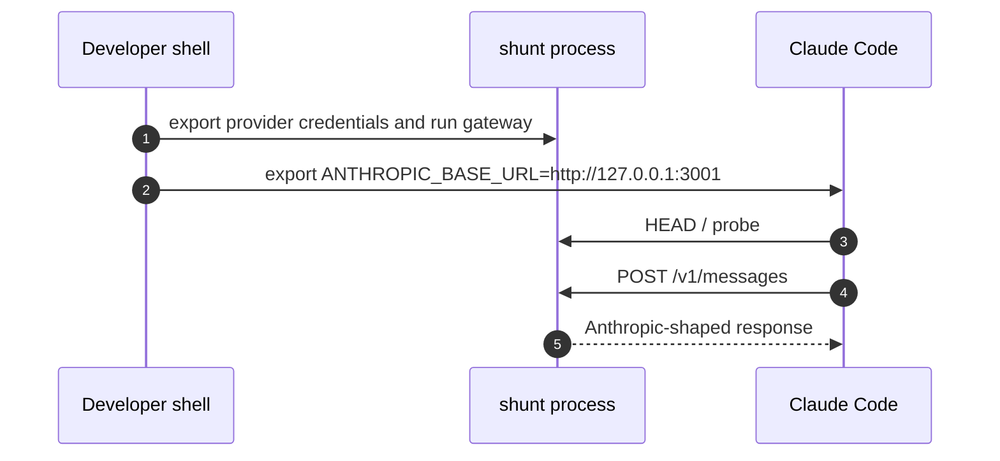

## Overview

Operationally, shunt is a local Rust binary plus a TOML config. You build it with Cargo, validate the config with `shunt check`, run the gateway, then start Claude Code with `ANTHROPIC_BASE_URL` pointing at the gateway. Provider credentials stay in the shunt process environment or Codex/Claude credential files; Claude Code does not send OpenAI or ChatGPT credentials for mapped models [docs/running.md:1-461](https://github.com/chatbot-pf/shunt/blob/main/docs/running.md#L1-L461) [src/auth/mod.rs:29-99](https://github.com/chatbot-pf/shunt/blob/main/src/auth/mod.rs#L29-L99).

| Operation | Command | Why it exists | Source |
|---|---|---|---|
| Debug build | `cargo build` | Compile the gateway while developing | [docs/running.md:26-37](https://github.com/chatbot-pf/shunt/blob/main/docs/running.md#L26-L37) |
| Release build | `cargo build --release` | Produce `target/release/shunt` for daily use | [docs/running.md:31-34](https://github.com/chatbot-pf/shunt/blob/main/docs/running.md#L31-L34) |
| Config check | `cargo run -- check` or `shunt check` | Validate before binding or connecting Claude Code | [src/main.rs:77-83](https://github.com/chatbot-pf/shunt/blob/main/src/main.rs#L77-L83) |
| Run | `cargo run -- run` or `shunt run` | Start Axum HTTP gateway | [src/main.rs:38-76](https://github.com/chatbot-pf/shunt/blob/main/src/main.rs#L38-L76) |
| Token helper | `shunt token` | Print Claude subscription token for `apiKeyHelper` | [src/main.rs:51-58](https://github.com/chatbot-pf/shunt/blob/main/src/main.rs#L51-L58) |
| CI validation | `cargo fmt`, `cargo clippy`, `cargo test` | Enforced before PR merge | [.github/workflows/ci.yml:1-42](https://github.com/chatbot-pf/shunt/blob/main/.github/workflows/ci.yml#L1-L42) |

## Command Lifecycle

```mermaid
flowchart TB
    Start[Clone repo] --> Build[cargo build --release]
    Build --> Config[cp shunt.toml.example shunt.toml]
    Config --> Check[shunt check]
    Check -->|ok| Run[shunt run]
    Check -->|error| Fix[Fix TOML or env]
    Fix --> Check
    Run --> Claude[Start Claude Code with ANTHROPIC_BASE_URL]
    Claude --> Verify[Run curl or model picker smoke]
    classDef dark fill:#2d333b,stroke:#6d5dfc,color:#e6edf3;
    class Start,Build,Config,Check,Run,Fix,Claude,Verify dark;
    linkStyle default stroke:#8b949e;
```
<!-- Sources: docs/running.md:26, docs/running.md:40, src/main.rs:77, src/main.rs:60, docs/running.md:189, docs/running.md:395 -->

## Connect Claude Code


<!-- Sources: docs/running.md:163, docs/running.md:189, src/server.rs:21, src/server.rs:23 -->

## CI Pipeline

```mermaid
flowchart LR
    PR[Push or pull_request] --> Checkout[Checkout pinned SHA]
    Checkout --> Rust[Install stable Rust + rustfmt + clippy]
    Rust --> Cache[Cargo cache]
    Cache --> Fmt[cargo fmt --all --check]
    Fmt --> Clippy[cargo clippy --all-targets --all-features -- -D warnings]
    Clippy --> Test[cargo test --all-features --workspace]
    classDef dark fill:#2d333b,stroke:#6d5dfc,color:#e6edf3;
    class PR,Checkout,Rust,Cache,Fmt,Clippy,Test dark;
    linkStyle default stroke:#8b949e;
```
<!-- Sources: .github/workflows/ci.yml:1, .github/workflows/ci.yml:23, .github/workflows/ci.yml:27, .github/workflows/ci.yml:32, .github/workflows/ci.yml:35, .github/workflows/ci.yml:38, .github/workflows/ci.yml:41 -->

## Troubleshooting Table

| Symptom | Likely cause | Fix | Source |
|---|---|---|---|
| `config check failed` | Bad bind address, provider URL, missing env setting, or unknown provider reference | Run `shunt check` and follow typed error | [src/config.rs:196-242](https://github.com/chatbot-pf/shunt/blob/main/src/config.rs#L196-L242) |
| `ChatGPT auth not found; run codex login` | `~/.codex/auth.json` is absent or unreadable | Run `codex login` | [src/auth/codex_auth.rs:34-63](https://github.com/chatbot-pf/shunt/blob/main/src/auth/codex_auth.rs#L34-L63) |
| Model absent in `/model` | `gpt-*` IDs are ignored by gateway discovery | Use `ANTHROPIC_CUSTOM_MODEL_OPTION` or a Claude-named alias | [docs/running.md:231-287](https://github.com/chatbot-pf/shunt/blob/main/docs/running.md#L231-L287) |
| Claude passthrough fails | Gateway credential is dummy or missing | Use real Anthropic credential or `shunt token` helper | [docs/running.md:289-348](https://github.com/chatbot-pf/shunt/blob/main/docs/running.md#L289-L348) |
| OpenAI/Codex model rejected | Upstream slug not entitled or unsupported | Use an entitled slug or `upstream_model` | [docs/running.md:244-252](https://github.com/chatbot-pf/shunt/blob/main/docs/running.md#L244-L252) |

## Related Pages

| Page | Relationship |
|---|---|
| [Configuration](./configuration.md) | Defines the settings operations validate |
| [Authentication](../02-deep-dive/authentication.md) | Explains credential sources and refresh |
| [Testing and Quality](../02-deep-dive/testing-and-quality.md) | Expands on CI and test coverage |
| [Contributor Guide](../onboarding/contributor-guide.md) | Contributor workflow using these commands |

## References

- [docs/running.md:1-461](https://github.com/chatbot-pf/shunt/blob/main/docs/running.md#L1-L461)
- [src/main.rs:38-76](https://github.com/chatbot-pf/shunt/blob/main/src/main.rs#L38-L76)
- [src/server.rs:13-25](https://github.com/chatbot-pf/shunt/blob/main/src/server.rs#L13-L25)
- [.github/workflows/ci.yml:1-42](https://github.com/chatbot-pf/shunt/blob/main/.github/workflows/ci.yml#L1-L42)
- [tests/passthrough.rs:72-247](https://github.com/chatbot-pf/shunt/blob/main/tests/passthrough.rs#L72-L247)
