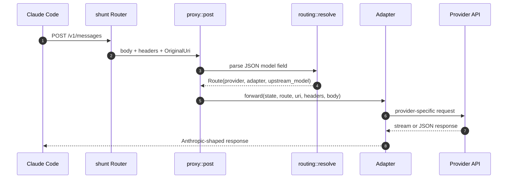

## Overview

`shunt` exists because Claude Code can talk to a first-class LLM gateway through `ANTHROPIC_BASE_URL`, but teams sometimes want only selected model IDs to run on another provider while the rest of the Claude Code session keeps its normal tools, skills, settings, and Anthropic pass-through behavior. The project implements that gateway as a Rust/Axum process that routes by the request `model` instead of trying to infer caller identity from prompts [README.md:1-60](https://github.com/chatbot-pf/shunt/blob/main/README.md#L1-L60) [docs/implementation-plan.md:46-71](https://github.com/chatbot-pf/shunt/blob/main/docs/implementation-plan.md#L46-L71).

| Component | Responsibility | Key file | Source |
|---|---|---|---|
| CLI process | Starts server, validates config, prints token helper output | `src/main.rs` | [src/main.rs:38-76](https://github.com/chatbot-pf/shunt/blob/main/src/main.rs#L38-L76) |
| Router | Exposes `HEAD /`, `GET /v1/models`, `POST /v1/messages`, and `POST /v1/messages/count_tokens` | `src/server.rs` | [src/server.rs:13-25](https://github.com/chatbot-pf/shunt/blob/main/src/server.rs#L13-L25) |
| Proxy handler | Buffers request, resolves route, dispatches adapter, logs latency | `src/proxy.rs` | [src/proxy.rs:19-126](https://github.com/chatbot-pf/shunt/blob/main/src/proxy.rs#L19-L126) |
| Route resolver | Applies exact, prefix, then default provider precedence | `src/routing.rs` | [src/routing.rs:37-89](https://github.com/chatbot-pf/shunt/blob/main/src/routing.rs#L37-L89) |
| Config | Defines built-in providers and validates routes/providers | `src/config.rs` | [src/config.rs:142-183](https://github.com/chatbot-pf/shunt/blob/main/src/config.rs#L142-L183) |
| Translation | Converts Anthropic request/stream shapes to and from Responses | `src/model/responses_request.rs`, `src/model/responses.rs` | [src/model/responses_request.rs:4-280](https://github.com/chatbot-pf/shunt/blob/main/src/model/responses_request.rs#L4-L280) [src/model/responses.rs:45-378](https://github.com/chatbot-pf/shunt/blob/main/src/model/responses.rs#L45-L378) |

## Gateway Position

```mermaid
graph TB
    subgraph Client[Claude Code process]
      ModelPicker[/model picker]
      ToolLoop[Tool loop and skills]
    end
    subgraph Gateway[shunt]
      Server[Axum router]
      Resolver[Model route resolver]
      Adapter[Selected adapter]
    end
    subgraph Upstreams[Provider APIs]
      Anthropic[Anthropic-compatible Messages API]
      Responses[OpenAI Responses API]
    end
    ModelPicker --> ToolLoop --> Server --> Resolver --> Adapter
    Adapter --> Anthropic
    Adapter --> Responses
    classDef dark fill:#2d333b,stroke:#6d5dfc,color:#e6edf3;
    class ModelPicker,ToolLoop,Server,Resolver,Adapter,Anthropic,Responses dark;
    style Client fill:#161b22,stroke:#30363d,color:#e6edf3;
    style Gateway fill:#161b22,stroke:#30363d,color:#e6edf3;
    style Upstreams fill:#161b22,stroke:#30363d,color:#e6edf3;
    linkStyle default stroke:#8b949e;
```
<!-- Sources: README.md:14, src/server.rs:13, src/routing.rs:37, src/adapters/anthropic.rs:31, src/adapters/responses.rs:34 -->

## Request Lifecycle


<!-- Sources: src/server.rs:19, src/proxy.rs:19, src/routing.rs:37, src/adapters/mod.rs:21, src/adapters/responses.rs:34 -->

## Runtime States

```mermaid
stateDiagram-v2
    [*] --> ConfigLoad
    ConfigLoad --> Listening: valid config
    ConfigLoad --> Failed: validation error
    Listening --> RequestBuffered: POST received
    RequestBuffered --> Routed: model parsed
    Routed --> AnthropicPath: AdapterKind::Anthropic
    Routed --> ResponsesPath: AdapterKind::Responses
    AnthropicPath --> StreamBack
    ResponsesPath --> TranslateBack
    StreamBack --> Listening
    TranslateBack --> Listening
    Failed --> [*]
```
<!-- Sources: src/main.rs:60, src/config.rs:196, src/proxy.rs:93, src/routing.rs:48, src/adapters/responses.rs:61 -->

## Why Model-Based Routing

| Approach | shunt decision | Reason | Source |
|---|---|---|---|
| Prompt fingerprinting | Not used | The request already contains the selected model ID, so prompt-shape coupling is unnecessary | [docs/implementation-plan.md:24-32](https://github.com/chatbot-pf/shunt/blob/main/docs/implementation-plan.md#L24-L32) |
| Global provider swap | Not the focus | Unmapped models must continue to pass through to Anthropic | [README.md:43-56](https://github.com/chatbot-pf/shunt/blob/main/README.md#L43-L56) |
| Per-model mapping | Primary mechanism | Claude Code lets users pick model IDs per context; shunt honors those IDs | [README.md:18-20](https://github.com/chatbot-pf/shunt/blob/main/README.md#L18-L20) |

## Related Pages

| Page | Relationship |
|---|---|
| [Configuration](./configuration.md) | Explains how model IDs map to providers |
| [Operations](./operations.md) | Turns the overview into runnable commands |
| [Architecture](../02-deep-dive/architecture.md) | Deep runtime component map |
| [Adapters and Translation](../02-deep-dive/adapters-and-translation.md) | Details the adapter implementation |

## References

- [README.md:1-60](https://github.com/chatbot-pf/shunt/blob/main/README.md#L1-L60)
- [src/main.rs:38-76](https://github.com/chatbot-pf/shunt/blob/main/src/main.rs#L38-L76)
- [src/server.rs:13-25](https://github.com/chatbot-pf/shunt/blob/main/src/server.rs#L13-L25)
- [src/proxy.rs:19-126](https://github.com/chatbot-pf/shunt/blob/main/src/proxy.rs#L19-L126)
- [src/routing.rs:37-89](https://github.com/chatbot-pf/shunt/blob/main/src/routing.rs#L37-L89)
