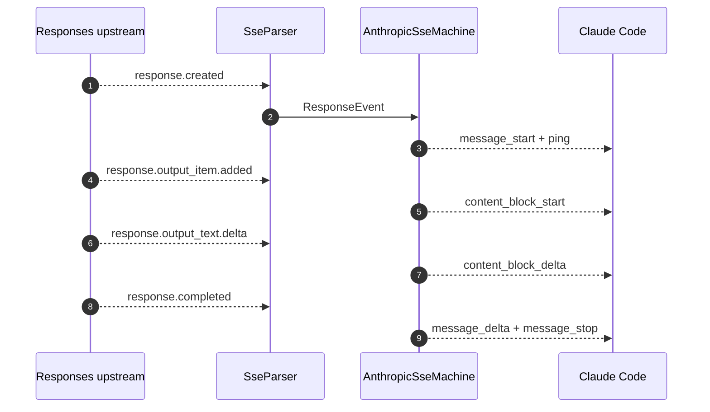
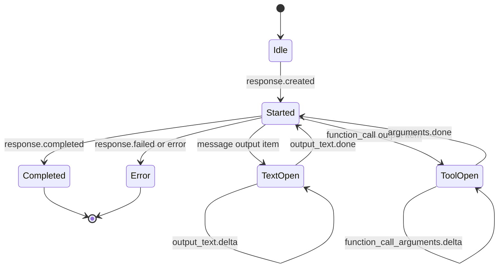

## Overview

Adapters are the protocol boundary. The Anthropic adapter preserves the Anthropic Messages shape and streams upstream bytes back to Claude Code. The Responses adapter rebuilds the request for OpenAI's Responses API, sends provider-specific credentials, and converts Responses SSE events into Anthropic SSE events through a state machine [src/adapters/anthropic.rs:31-104](https://github.com/chatbot-pf/shunt/blob/main/src/adapters/anthropic.rs#L31-L104) [src/adapters/responses.rs:34-213](https://github.com/chatbot-pf/shunt/blob/main/src/adapters/responses.rs#L34-L213) [src/model/responses_request.rs:4-280](https://github.com/chatbot-pf/shunt/blob/main/src/model/responses_request.rs#L4-L280) [src/model/responses.rs:45-378](https://github.com/chatbot-pf/shunt/blob/main/src/model/responses.rs#L45-L378).

| Adapter | Provider kinds | Mutation level | Streaming behavior | Source |
|---|---|---|---|---|
| `AnthropicAdapter` | `kind = "anthropic"` | Header credential swap only for API-key providers; body is unchanged | Relays upstream `bytes_stream()` | [src/adapters/anthropic.rs:31-104](https://github.com/chatbot-pf/shunt/blob/main/src/adapters/anthropic.rs#L31-L104) |
| `ResponsesAdapter` | `kind = "responses"` | Full request rebuild into Responses shape | Parses upstream SSE and emits Anthropic SSE | [src/adapters/responses.rs:34-213](https://github.com/chatbot-pf/shunt/blob/main/src/adapters/responses.rs#L34-L213) |
| `translate_request` | Responses providers | Maps system/messages/tools/effort into Responses request | Always requests upstream streaming | [src/model/responses_request.rs:4-280](https://github.com/chatbot-pf/shunt/blob/main/src/model/responses_request.rs#L4-L280) |
| `ResponsesFlavor` | Responses providers | Gates per-backend dialect quirks (OpenAI / ChatGPT-Codex / xAI) table-driven from auth mode + base-URL host | xAI: reasoning opt-in, no `text` object, no `OpenAI-Beta` header; ChatGPT: no `max_output_tokens` | [src/config.rs:167-186](https://github.com/chatbot-pf/shunt/blob/main/src/config.rs#L167-L186) [src/config.rs:489-505](https://github.com/chatbot-pf/shunt/blob/main/src/config.rs#L489-L505) |
| `AnthropicSseMachine` | Responses providers | Converts response events into content blocks and final JSON | Supports stream and non-stream output | [src/model/responses.rs:62-113](https://github.com/chatbot-pf/shunt/blob/main/src/model/responses.rs#L62-L113) |

## Adapter Dispatch

```mermaid
flowchart TB
    Route[Route adapter] --> Choice{AdapterKind}
    Choice -->|Anthropic| A[AnthropicAdapter.forward]
    Choice -->|Responses| R[ResponsesAdapter.forward]
    A --> AU[upstream_url + filtered headers]
    R --> TR[translate_request]
    R --> RB[request_builder + responses_url]
    R --> SM[AnthropicSseMachine]
    classDef dark fill:#2d333b,stroke:#6d5dfc,color:#e6edf3;
    class Route,Choice,A,R,AU,TR,RB,SM dark;
    linkStyle default stroke:#8b949e;
```
<!-- Sources: src/proxy.rs:113, src/adapters/anthropic.rs:18, src/adapters/responses.rs:21, src/model/responses_request.rs:4, src/model/responses.rs:24 -->

## Request Translation

```mermaid
flowchart LR
    AM[Anthropic Messages JSON] --> System[system to instructions]
    AM --> Messages[messages to input items]
    AM --> Tools[tools to function tools]
    AM --> Choice[tool_choice mapping]
    AM --> Effort[effort mapping]
    System --> OR[OpenAI Responses request]
    Messages --> OR
    Tools --> OR
    Choice --> OR
    Effort --> OR
    OR --> Stream[stream true and store false]
    classDef dark fill:#2d333b,stroke:#6d5dfc,color:#e6edf3;
    class AM,System,Messages,Tools,Choice,Effort,OR,Stream dark;
    linkStyle default stroke:#8b949e;
```
<!-- Sources: src/model/responses_request.rs:4, src/model/responses_request.rs:31, src/model/responses_request.rs:47, src/model/responses_request.rs:198, src/model/responses_request.rs:233, src/model/responses_request.rs:254 -->

## Streaming Conversion


<!-- Sources: src/adapters/responses.rs:68, src/adapters/responses.rs:226, src/model/responses.rs:62, src/model/responses.rs:115, src/model/responses.rs:206, src/model/responses.rs:273 -->

## SSE State Machine


<!-- Sources: src/model/responses.rs:62, src/model/responses.rs:146, src/model/responses.rs:206, src/model/responses.rs:222, src/model/responses.rs:273 -->

## Translation Coverage

| Anthropic concept | Responses concept | Implementation | Test coverage | Source |
|---|---|---|---|---|
| `system` string/blocks | `instructions` | `instructions()` | Plain-text request test | [src/model/responses_request.rs:31-45](https://github.com/chatbot-pf/shunt/blob/main/src/model/responses_request.rs#L31-L45) [tests/responses_translate.rs:25-50](https://github.com/chatbot-pf/shunt/blob/main/tests/responses_translate.rs#L25-L50) |
| User text blocks | `input_text` | `text_part()` | Multi-turn role test | [src/model/responses_request.rs:113-123](https://github.com/chatbot-pf/shunt/blob/main/src/model/responses_request.rs#L113-L123) [tests/responses_translate.rs:52-71](https://github.com/chatbot-pf/shunt/blob/main/tests/responses_translate.rs#L52-L71) |
| Images | Data URL `input_image` | `image_part()` | Image translation test | [src/model/responses_request.rs:126-138](https://github.com/chatbot-pf/shunt/blob/main/src/model/responses_request.rs#L126-L138) [tests/responses_translate.rs:98-119](https://github.com/chatbot-pf/shunt/blob/main/tests/responses_translate.rs#L98-L119) |
| Tool use | `function_call` | `tool_use_item()` | Tool call ID test | [src/model/responses_request.rs:140-148](https://github.com/chatbot-pf/shunt/blob/main/src/model/responses_request.rs#L140-L148) [tests/responses_translate.rs:73-96](https://github.com/chatbot-pf/shunt/blob/main/tests/responses_translate.rs#L73-L96) |
| Reasoning effort | `reasoning.effort` | `effort()` | Thinking and override test | [src/model/responses_request.rs:254-280](https://github.com/chatbot-pf/shunt/blob/main/src/model/responses_request.rs#L254-L280) [tests/responses_translate.rs:164-178](https://github.com/chatbot-pf/shunt/blob/main/tests/responses_translate.rs#L164-L178) |

## Error Mapping

Upstream errors on the `responses` path are re-shaped into the Anthropic error envelope by `map_error_value`, with the `error.type` derived from the upstream status (401 → `authentication_error`, 429 → `rate_limit_error`, 400 → `invalid_request_error`, other → `api_error`) and the upstream message preserved ([src/model/responses.rs:532-563](https://github.com/chatbot-pf/shunt/blob/main/src/model/responses.rs#L532-L563)).

Context-overflow errors are the one case where the message itself is rewritten: Claude Code's automatic compact-and-retry matches the literal phrase `prompt is too long` and parses `N tokens > M maximum` to size the retry, so upstream phrasings (`context_length_exceeded`, "maximum context length is N tokens", "prompt token count of N exceeds the limit of M") are detected and rewritten to that shape, keeping the token counts when the upstream message carries them ([src/model/responses.rs:566-616](https://github.com/chatbot-pf/shunt/blob/main/src/model/responses.rs#L566-L616), [tests/responses_translate.rs:368-417](https://github.com/chatbot-pf/shunt/blob/main/tests/responses_translate.rs#L368-L417)).

```mermaid
flowchart LR
    Upstream[Upstream error body] --> Detect{context overflow?}
    Detect -->|no| Preserve[original message]
    Detect -->|yes| Rewrite["prompt is too long: N tokens > M maximum"]
    Preserve --> Envelope[Anthropic error envelope]
    Rewrite --> Envelope
    classDef dark fill:#2d333b,stroke:#6d5dfc,color:#e6edf3;
    class Upstream,Detect,Preserve,Rewrite,Envelope dark;
    linkStyle default stroke:#8b949e;
```
<!-- Sources: src/model/responses.rs:532, src/model/responses.rs:573, src/adapters/responses.rs:153 -->

## Related Pages

| Page | Relationship |
|---|---|
| [Architecture](./architecture.md) | Shows adapter layer in context |
| [Routing and Configuration](./routing-and-configuration.md) | Explains how a provider selects an adapter |
| [Authentication](./authentication.md) | Explains credentials adapters consume |
| [Testing and Quality](./testing-and-quality.md) | Shows tests that lock translation behavior |

## References

- [src/adapters/anthropic.rs:31-104](https://github.com/chatbot-pf/shunt/blob/main/src/adapters/anthropic.rs#L31-L104)
- [src/adapters/responses.rs:34-213](https://github.com/chatbot-pf/shunt/blob/main/src/adapters/responses.rs#L34-L213)
- [src/model/responses_request.rs:4-280](https://github.com/chatbot-pf/shunt/blob/main/src/model/responses_request.rs#L4-L280)
- [src/model/responses.rs:45-378](https://github.com/chatbot-pf/shunt/blob/main/src/model/responses.rs#L45-L378)
- [tests/responses_translate.rs:25-287](https://github.com/chatbot-pf/shunt/blob/main/tests/responses_translate.rs#L25-L287)
