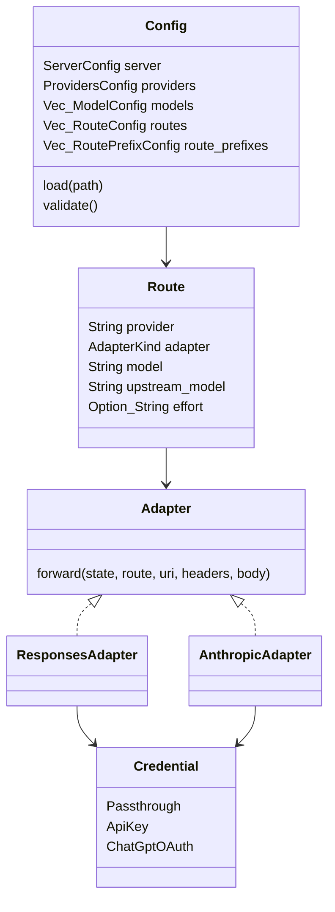
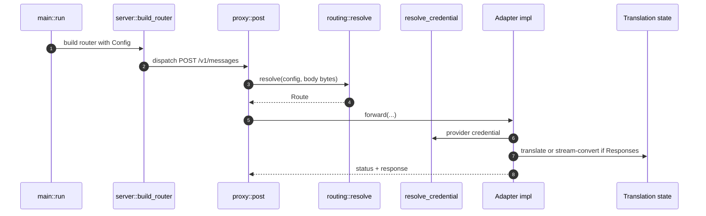
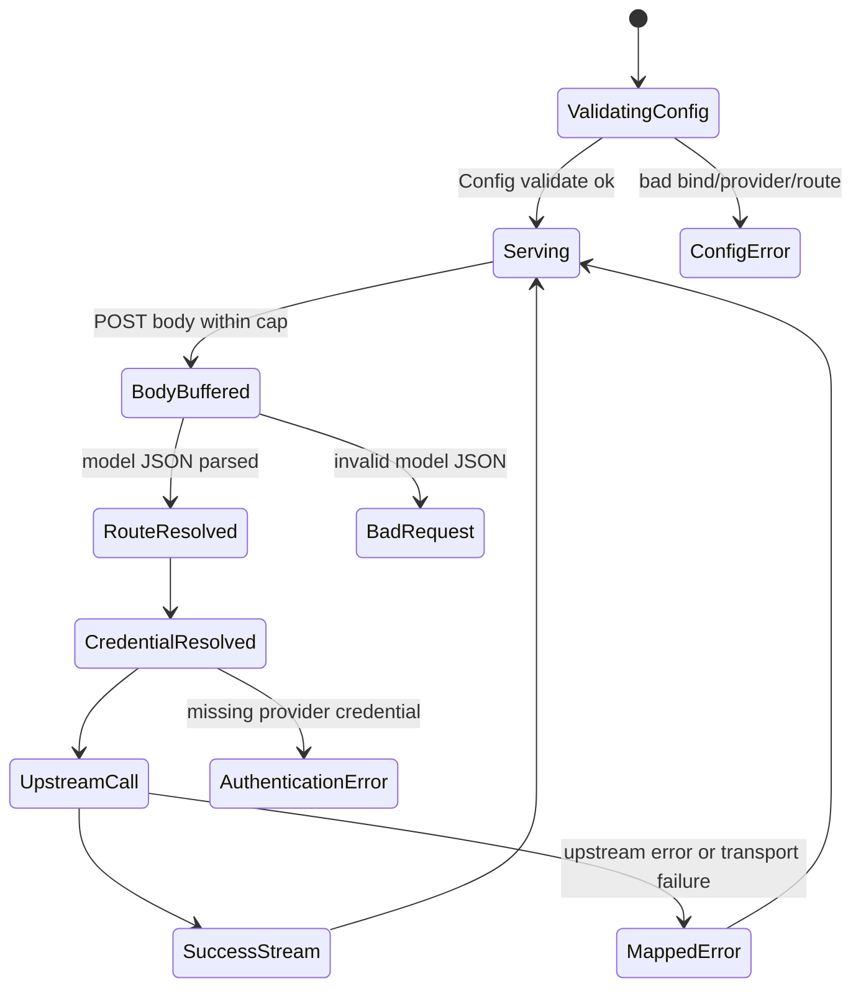

## Overview

The core architectural insight is that shunt is not a second agent runtime. It is a protocol-preserving gateway inserted at Claude Code's inference boundary. Because Claude Code already sends a `model` field, shunt can stay stateless for routing: parse the model, choose a provider, and hand the request to the adapter responsible for that provider's protocol [docs/implementation-plan.md:6-249](https://github.com/chatbot-pf/shunt/blob/main/docs/implementation-plan.md#L6-L249) [src/routing.rs:37-89](https://github.com/chatbot-pf/shunt/blob/main/src/routing.rs#L37-L89).

| Component | Responsibility | Key file | Source |
|---|---|---|---|
| `AppState` | Holds validated config and shared reqwest client | `src/server.rs` | [src/server.rs:13-25](https://github.com/chatbot-pf/shunt/blob/main/src/server.rs#L13-L25) |
| `proxy::post` | Entry handler for inference and count-token posts | `src/proxy.rs` | [src/proxy.rs:19-126](https://github.com/chatbot-pf/shunt/blob/main/src/proxy.rs#L19-L126) |
| `Route` | Carries provider, adapter kind, model, upstream model, effort | `src/routing.rs` | [src/routing.rs:23-31](https://github.com/chatbot-pf/shunt/blob/main/src/routing.rs#L23-L31) |
| `Adapter` trait | Hides provider protocol differences behind one async `forward` | `src/adapters/mod.rs` | [src/adapters/mod.rs:21-30](https://github.com/chatbot-pf/shunt/blob/main/src/adapters/mod.rs#L21-L30) |
| `Credential` | Represents pass-through, API-key, and ChatGPT OAuth modes | `src/auth/mod.rs` | [src/auth/mod.rs:17-28](https://github.com/chatbot-pf/shunt/blob/main/src/auth/mod.rs#L17-L28) |
| `AnthropicSseMachine` | Converts Responses event streams into Anthropic event streams | `src/model/responses.rs` | [src/model/responses.rs:62-113](https://github.com/chatbot-pf/shunt/blob/main/src/model/responses.rs#L62-L113) |

## System Architecture

```mermaid
graph TB
    subgraph Entry[Process entry]
      CLI[src/main.rs CLI]
      Config[Config load and validate]
    end
    subgraph HTTP[HTTP gateway]
      Router[server::build_router]
      Proxy[proxy::post]
      Discovery[discovery::get]
    end
    subgraph RoutingCore[Routing core]
      Resolver[routing::resolve_model]
      Route[Route]
    end
    subgraph AdapterLayer[Adapter layer]
      Anthropic[AnthropicAdapter]
      Responses[ResponsesAdapter]
    end
    subgraph Models[Translation model]
      Request[translate_request]
      SSE[AnthropicSseMachine]
    end
    CLI --> Config --> Router
    Router --> Proxy --> Resolver --> Route
    Router --> Discovery
    Route --> Anthropic
    Route --> Responses --> Request
    Responses --> SSE
    classDef dark fill:#2d333b,stroke:#6d5dfc,color:#e6edf3;
    class CLI,Config,Router,Proxy,Discovery,Resolver,Route,Anthropic,Responses,Request,SSE dark;
    style Entry fill:#161b22,stroke:#30363d,color:#e6edf3;
    style HTTP fill:#161b22,stroke:#30363d,color:#e6edf3;
    style RoutingCore fill:#161b22,stroke:#30363d,color:#e6edf3;
    style AdapterLayer fill:#161b22,stroke:#30363d,color:#e6edf3;
    style Models fill:#161b22,stroke:#30363d,color:#e6edf3;
    linkStyle default stroke:#8b949e;
```
<!-- Sources: src/main.rs:38, src/config.rs:185, src/server.rs:13, src/proxy.rs:19, src/routing.rs:48, src/adapters/mod.rs:21, src/model/responses.rs:24 -->

## Core Types


<!-- Sources: src/config.rs:9, src/routing.rs:23, src/adapters/mod.rs:21, src/adapters/anthropic.rs:18, src/adapters/responses.rs:21, src/auth/mod.rs:17 -->

## Request Sequence


<!-- Sources: src/main.rs:73, src/server.rs:19, src/proxy.rs:39, src/routing.rs:37, src/auth/mod.rs:29, src/adapters/responses.rs:43 -->

## State and Failure Paths


<!-- Sources: src/config.rs:196, src/proxy.rs:17, src/routing.rs:37, src/auth/mod.rs:82, src/adapters/responses.rs:128, src/error.rs:40 -->

## Architectural Invariants

| Invariant | Enforced by | Why it matters | Source |
|---|---|---|---|
| Request bodies are buffered only to choose a route | `to_bytes(..., 64 MiB)` before `routing::resolve` | Routing needs `model`, while responses must still stream | [src/proxy.rs:17-112](https://github.com/chatbot-pf/shunt/blob/main/src/proxy.rs#L17-L112) |
| Response streaming is preserved | `Body::from_stream` for both pass-through and Responses | Claude Code expects incremental SSE | [src/adapters/anthropic.rs:49-62](https://github.com/chatbot-pf/shunt/blob/main/src/adapters/anthropic.rs#L49-L62) [src/adapters/responses.rs:68-111](https://github.com/chatbot-pf/shunt/blob/main/src/adapters/responses.rs#L68-L111) |
| Route precedence is deterministic | `resolve_model` loops exact routes before prefixes before default | Prevents broad prefixes from shadowing explicit mappings | [src/routing.rs:37-89](https://github.com/chatbot-pf/shunt/blob/main/src/routing.rs#L37-L89) |
| Adapter selection follows provider kind | `ProviderKind` to `AdapterKind` conversion | Provider config controls protocol boundary | [src/routing.rs:14-21](https://github.com/chatbot-pf/shunt/blob/main/src/routing.rs#L14-L21) |
| Gateway-owned errors use Anthropic error envelope | `ShuntError` and `UpstreamError` `IntoResponse` | Claude Code can interpret failures consistently | [src/error.rs:7-91](https://github.com/chatbot-pf/shunt/blob/main/src/error.rs#L7-L91) |

## Related Pages

| Page | Relationship |
|---|---|
| [Routing and Configuration](./routing-and-configuration.md) | Deep dive into config and route resolver |
| [Adapters and Translation](./adapters-and-translation.md) | Deep dive into adapter internals |
| [Authentication](./authentication.md) | Credential resolution and refresh |
| [Testing and Quality](./testing-and-quality.md) | Tests that enforce the architecture |

## References

- [src/main.rs:38-76](https://github.com/chatbot-pf/shunt/blob/main/src/main.rs#L38-L76)
- [src/server.rs:13-25](https://github.com/chatbot-pf/shunt/blob/main/src/server.rs#L13-L25)
- [src/proxy.rs:19-126](https://github.com/chatbot-pf/shunt/blob/main/src/proxy.rs#L19-L126)
- [src/routing.rs:37-89](https://github.com/chatbot-pf/shunt/blob/main/src/routing.rs#L37-L89)
- [src/config.rs:9-269](https://github.com/chatbot-pf/shunt/blob/main/src/config.rs#L9-L269)
- [src/adapters/responses.rs:34-213](https://github.com/chatbot-pf/shunt/blob/main/src/adapters/responses.rs#L34-L213)
