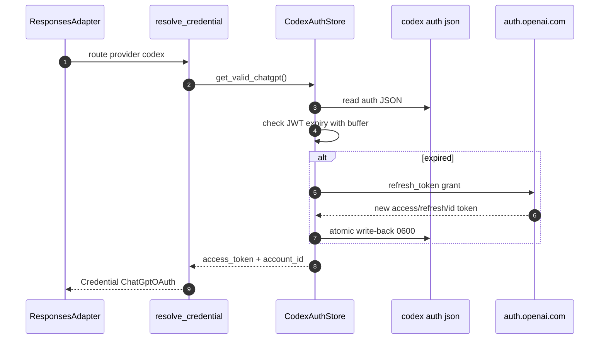
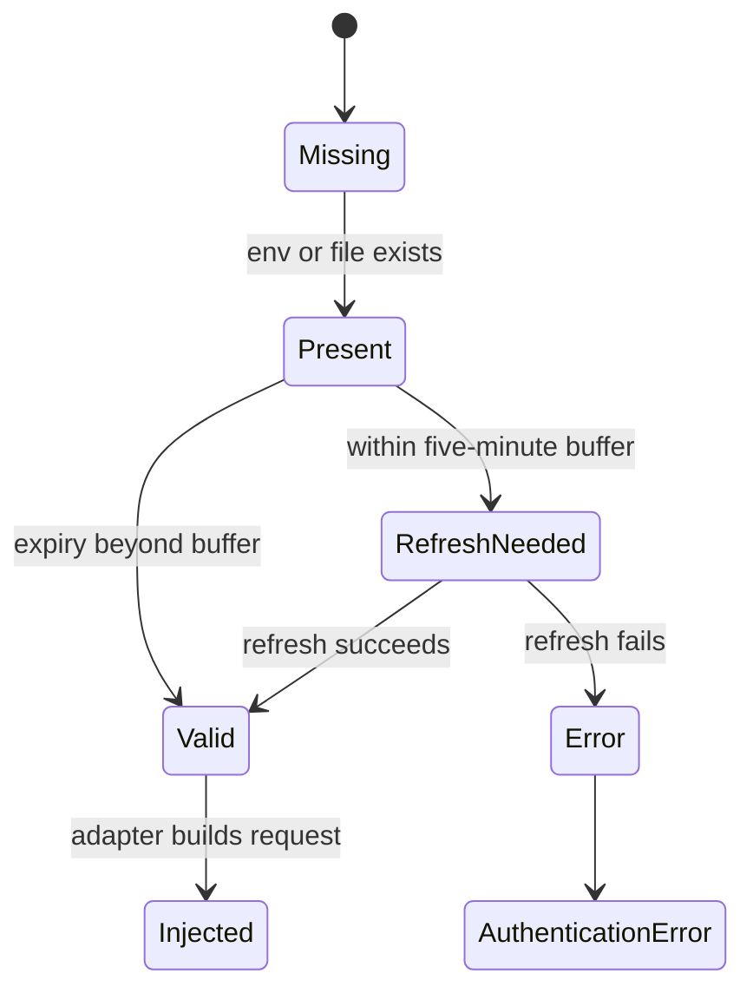

## Overview

Authentication is intentionally route-scoped. Once routing selects a provider, shunt resolves the credential strategy declared by that provider: pass through the Claude Code credential, read an API key, or reuse and refresh ChatGPT/Codex OAuth tokens. That separation keeps Claude Code from needing provider-specific secrets for mapped models [src/auth/mod.rs:29-99](https://github.com/chatbot-pf/shunt/blob/main/src/auth/mod.rs#L29-L99) [src/auth/codex_auth.rs:34-63](https://github.com/chatbot-pf/shunt/blob/main/src/auth/codex_auth.rs#L34-L63) [src/auth/claude_auth.rs:27-92](https://github.com/chatbot-pf/shunt/blob/main/src/auth/claude_auth.rs#L27-L92).

| Credential mode | Used by | Secret source | Boundary | Source |
|---|---|---|---|---|
| `Passthrough` | Anthropic default provider | Inbound Claude Code headers | Forwarded unchanged | [src/auth/mod.rs:17-22](https://github.com/chatbot-pf/shunt/blob/main/src/auth/mod.rs#L17-L22) [src/adapters/anthropic.rs:66-89](https://github.com/chatbot-pf/shunt/blob/main/src/adapters/anthropic.rs#L66-L89) |
| `ApiKey` | OpenAI and Anthropic-compatible gateways | Env var named by `api_key_env`, with OpenAI fallback to Codex auth JSON | Injected by shunt | [src/auth/mod.rs:57-80](https://github.com/chatbot-pf/shunt/blob/main/src/auth/mod.rs#L57-L80) |
| `ChatGptOAuth` | `codex` provider | `~/.codex/auth.json` | Refreshed and sent with account ID | [src/auth/codex_auth.rs:34-63](https://github.com/chatbot-pf/shunt/blob/main/src/auth/codex_auth.rs#L34-L63) |
| Claude token helper | Claude Code gateway discovery/pass-through credential | `SHUNT_GATEWAY_TOKEN`, `CLAUDE_CODE_OAUTH_TOKEN`, or `~/.claude/.credentials.json` | Printed to stdout for `apiKeyHelper` | [src/auth/claude_auth.rs:27-92](https://github.com/chatbot-pf/shunt/blob/main/src/auth/claude_auth.rs#L27-L92) |

## Credential Resolution Flow

```mermaid
flowchart TB
    Route[Route provider] --> Provider[Config provider]
    Provider --> Auth{AuthMode}
    Auth -->|passthrough| Pass[Credential Passthrough]
    Auth -->|api_key| Env[Read api_key_env]
    Env -->|found| Api[Credential ApiKey]
    Env -->|OPENAI_API_KEY missing| CodexKey[Read OPENAI_API_KEY from codex auth]
    CodexKey --> Api
    Auth -->|chatgpt_oauth| Store[CodexAuthStore]
    Store --> Valid{Token valid beyond 5 min?}
    Valid -->|yes| Chat[Credential ChatGptOAuth]
    Valid -->|no| Refresh[Refresh token and atomic write-back]
    Refresh --> Chat
    classDef dark fill:#2d333b,stroke:#6d5dfc,color:#e6edf3;
    class Route,Provider,Auth,Pass,Env,Api,CodexKey,Store,Valid,Refresh,Chat dark;
    linkStyle default stroke:#8b949e;
```
<!-- Sources: src/auth/mod.rs:29, src/auth/mod.rs:57, src/auth/codex_auth.rs:34, src/auth/codex_auth.rs:125, src/auth/codex_auth.rs:207 -->

## Token Refresh Sequence


<!-- Sources: src/adapters/responses.rs:51, src/auth/mod.rs:44, src/auth/codex_auth.rs:34, src/auth/codex_auth.rs:172, src/auth/codex_auth.rs:213 -->

## Trust Boundaries

```mermaid
graph LR
    CC[Claude Code credential] -->|passthrough only| Anthropic[Anthropic-compatible upstream]
    Env[Provider API key env] -->|injected by shunt| OpenAI[OpenAI-compatible upstream]
    CodexFile[Codex auth JSON] -->|read and refresh by shunt| ChatGPT[ChatGPT Codex backend]
    ClaudeFile[Claude credentials JSON] -->|optional token helper| CC
    classDef dark fill:#2d333b,stroke:#6d5dfc,color:#e6edf3;
    class CC,Anthropic,Env,OpenAI,CodexFile,ChatGPT,ClaudeFile dark;
    linkStyle default stroke:#8b949e;
```
<!-- Sources: src/adapters/anthropic.rs:66, src/auth/mod.rs:57, src/auth/codex_auth.rs:201, src/auth/claude_auth.rs:94 -->

## Credential States


<!-- Sources: src/auth/mod.rs:82, src/auth/codex_auth.rs:125, src/auth/codex_auth.rs:172, src/adapters/responses.rs:174, src/adapters/anthropic.rs:71 -->

## Related Pages

| Page | Relationship |
|---|---|
| [Configuration](../01-getting-started/configuration.md) | Shows user-facing auth modes |
| [Operations](../01-getting-started/operations.md) | Shows `codex login`, `OPENAI_API_KEY`, and `shunt token` usage |
| [Adapters and Translation](./adapters-and-translation.md) | Shows where credentials are injected |
| [Testing and Quality](./testing-and-quality.md) | Covers auth-related unit tests |

## References

- [src/auth/mod.rs:29-99](https://github.com/chatbot-pf/shunt/blob/main/src/auth/mod.rs#L29-L99)
- [src/auth/codex_auth.rs:34-63](https://github.com/chatbot-pf/shunt/blob/main/src/auth/codex_auth.rs#L34-L63)
- [src/auth/codex_auth.rs:103-129](https://github.com/chatbot-pf/shunt/blob/main/src/auth/codex_auth.rs#L103-L129)
- [src/auth/claude_auth.rs:27-92](https://github.com/chatbot-pf/shunt/blob/main/src/auth/claude_auth.rs#L27-L92)
- [src/adapters/anthropic.rs:66-89](https://github.com/chatbot-pf/shunt/blob/main/src/adapters/anthropic.rs#L66-L89)
