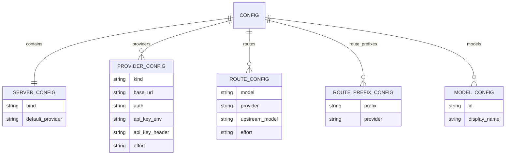
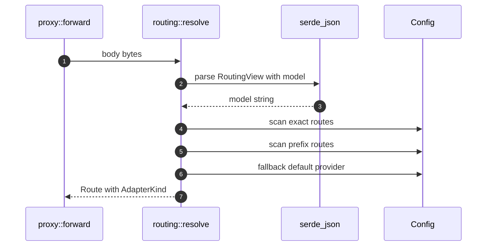

## Overview

Routing and configuration are deliberately simple: the config file describes providers and model mappings, and the resolver turns a request body's `model` string into a `Route`. The design favors data changes over code changes, which is why provider definitions are a `BTreeMap<String, ProviderConfig>` and why new Anthropic-compatible gateways can be added as TOML tables [src/config.rs:9-269](https://github.com/chatbot-pf/shunt/blob/main/src/config.rs#L9-L269) [src/routing.rs:37-89](https://github.com/chatbot-pf/shunt/blob/main/src/routing.rs#L37-L89).

| Topic | Mechanism | Key file | Source |
|---|---|---|---|
| Config structure | `Config`, `ServerConfig`, `ProviderConfig`, route structs | `src/config.rs` | [src/config.rs:9-107](https://github.com/chatbot-pf/shunt/blob/main/src/config.rs#L9-L107) |
| Defaults | Built-in `anthropic`, `openai`, `codex` providers | `src/config.rs` | [src/config.rs:142-183](https://github.com/chatbot-pf/shunt/blob/main/src/config.rs#L142-L183) |
| Loading | Figment defaults to TOML to `SHUNT_` env | `src/config.rs` | [src/config.rs:185-194](https://github.com/chatbot-pf/shunt/blob/main/src/config.rs#L185-L194) |
| Validation | URL, bind, auth, provider references | `src/config.rs` | [src/config.rs:196-242](https://github.com/chatbot-pf/shunt/blob/main/src/config.rs#L196-L242) |
| Routing | Exact to prefix to default | `src/routing.rs` | [src/routing.rs:37-89](https://github.com/chatbot-pf/shunt/blob/main/src/routing.rs#L37-L89) |

## Config Entity Model


<!-- Sources: src/config.rs:9, src/config.rs:27, src/config.rs:89, src/config.rs:97, src/config.rs:103 -->

## Loading and Validation Flow

```mermaid
flowchart TB
    Defaults[Serialized defaults] --> File[TOML file]
    File --> Env[SHUNT_ env]
    Env --> Extract[Figment extract Config]
    Extract --> Bind[Validate bind address]
    Bind --> Urls[Validate provider base URLs]
    Urls --> Auth[Validate api_key_env]
    Auth --> Refs[Validate default/route/prefix provider refs]
    Refs --> Warn[Warn discovery model without route]
    Warn --> Ok[Validated Config]
    classDef dark fill:#2d333b,stroke:#6d5dfc,color:#e6edf3;
    class Defaults,File,Env,Extract,Bind,Urls,Auth,Refs,Warn,Ok dark;
    linkStyle default stroke:#8b949e;
```
<!-- Sources: src/config.rs:185, src/config.rs:196, src/config.rs:198, src/config.rs:200, src/config.rs:212, src/config.rs:233 -->

## Routing Sequence


<!-- Sources: src/proxy.rs:93, src/routing.rs:32, src/routing.rs:37, src/routing.rs:49, src/routing.rs:60, src/routing.rs:65 -->

## Route Decision Table

| Input condition | Selected provider | Upstream model | Effort source | Source |
|---|---|---|---|---|
| Exact `route.model == model` | `route.provider` | `route.upstream_model` or original model | Route override, then provider default | [src/routing.rs:49-58](https://github.com/chatbot-pf/shunt/blob/main/src/routing.rs#L49-L58) |
| Prefix `model.starts_with(prefix)` | Prefix provider | Original model | Provider default | [src/routing.rs:60-64](https://github.com/chatbot-pf/shunt/blob/main/src/routing.rs#L60-L64) |
| No match | `server.default_provider` | Original model | Provider default | [src/routing.rs:65-66](https://github.com/chatbot-pf/shunt/blob/main/src/routing.rs#L65-L66) |
| Unknown provider after validation | Fallback adapter is Anthropic | Original model | None/provider default if present | [src/routing.rs:75-82](https://github.com/chatbot-pf/shunt/blob/main/src/routing.rs#L75-L82) |

## Adapter Selection

```mermaid
flowchart LR
    ProviderKind[ProviderKind] -->|anthropic| AnthropicKind[AdapterKind Anthropic]
    ProviderKind -->|responses| ResponsesKind[AdapterKind Responses]
    AnthropicKind --> Pass[Pass-through adapter]
    ResponsesKind --> Translate[Responses adapter]
    classDef dark fill:#2d333b,stroke:#6d5dfc,color:#e6edf3;
    class ProviderKind,AnthropicKind,ResponsesKind,Pass,Translate dark;
    linkStyle default stroke:#8b949e;
```
<!-- Sources: src/config.rs:52, src/routing.rs:14, src/adapters/anthropic.rs:16, src/adapters/responses.rs:19 -->

## Related Pages

| Page | Relationship |
|---|---|
| [Configuration](../01-getting-started/configuration.md) | User-facing configuration reference |
| [Architecture](./architecture.md) | Shows route resolver in the full runtime |
| [Authentication](./authentication.md) | Explains how selected providers get credentials |
| [Adapters and Translation](./adapters-and-translation.md) | Explains what each adapter does after routing |

## References

- [src/config.rs:9-269](https://github.com/chatbot-pf/shunt/blob/main/src/config.rs#L9-L269)
- [src/routing.rs:37-89](https://github.com/chatbot-pf/shunt/blob/main/src/routing.rs#L37-L89)
- [shunt.toml.example:1-134](https://github.com/chatbot-pf/shunt/blob/main/shunt.toml.example#L1-L134)
- [src/routing.rs:97-134](https://github.com/chatbot-pf/shunt/blob/main/src/routing.rs#L97-L134)
- [docs/running.md:40-159](https://github.com/chatbot-pf/shunt/blob/main/docs/running.md#L40-L159)
