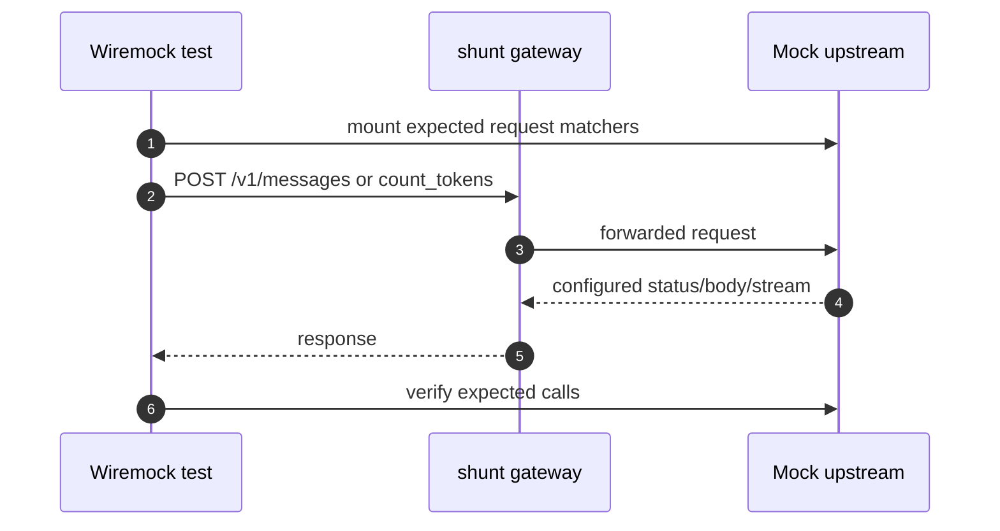
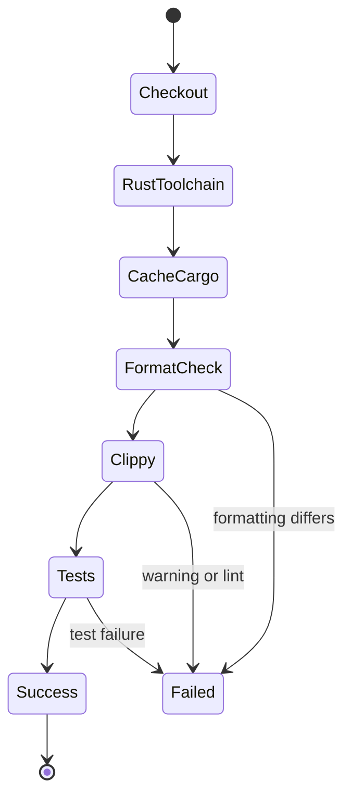

## Overview

Testing exists because shunt's correctness is mostly protocol preservation. The dangerous failures are subtle: a beta header split incorrectly, an SSE stream buffered until the end, a tool call ID lost during translation, or an upstream error hidden behind a generic gateway error. The repository uses colocated unit tests plus Wiremock integration tests to lock those behaviors down [tests/passthrough.rs:72-247](https://github.com/chatbot-pf/shunt/blob/main/tests/passthrough.rs#L72-L247) [tests/responses_translate.rs:25-287](https://github.com/chatbot-pf/shunt/blob/main/tests/responses_translate.rs#L25-L287).

| Test layer | Scope | Representative file | Source |
|---|---|---|---|
| Unit tests | Config, routing, auth, adapters, translation helpers | `src/**` module tests | [src/routing.rs:97-134](https://github.com/chatbot-pf/shunt/blob/main/src/routing.rs#L97-L134) [src/config.rs:301-391](https://github.com/chatbot-pf/shunt/blob/main/src/config.rs#L301-L391) |
| Integration tests | Axum gateway with mock upstream | `tests/passthrough.rs` | [tests/passthrough.rs:72-247](https://github.com/chatbot-pf/shunt/blob/main/tests/passthrough.rs#L72-L247) |
| Translation tests | Request conversion, SSE state machine, error mapping | `tests/responses_translate.rs` | [tests/responses_translate.rs:25-287](https://github.com/chatbot-pf/shunt/blob/main/tests/responses_translate.rs#L25-L287) |
| CI | Format, clippy with warnings denied, test suite | `.github/workflows/ci.yml` | [.github/workflows/ci.yml:1-42](https://github.com/chatbot-pf/shunt/blob/main/.github/workflows/ci.yml#L1-L42) |

## Test Architecture

```mermaid
graph TB
    subgraph Unit[Colocated unit tests]
      Config[config.rs tests]
      Routing[routing.rs tests]
      Auth[auth tests]
      Adapter[adapter tests]
    end
    subgraph Integration[tests]
      Pass[passthrough.rs]
      Translate[responses_translate.rs]
    end
    subgraph CI[GitHub Actions]
      Fmt[cargo fmt]
      Clippy[cargo clippy -D warnings]
      CargoTest[cargo test]
    end
    Unit --> CargoTest
    Integration --> CargoTest
    Fmt --> Clippy --> CargoTest
    classDef dark fill:#2d333b,stroke:#6d5dfc,color:#e6edf3;
    class Config,Routing,Auth,Adapter,Pass,Translate,Fmt,Clippy,CargoTest dark;
    style Unit fill:#161b22,stroke:#30363d,color:#e6edf3;
    style Integration fill:#161b22,stroke:#30363d,color:#e6edf3;
    style CI fill:#161b22,stroke:#30363d,color:#e6edf3;
    linkStyle default stroke:#8b949e;
```
<!-- Sources: src/routing.rs:91, src/config.rs:277, tests/passthrough.rs:72, tests/responses_translate.rs:25, .github/workflows/ci.yml:35 -->

## Pass-through Integration Flow


<!-- Sources: tests/passthrough.rs:90, tests/passthrough.rs:96, tests/passthrough.rs:110, tests/passthrough.rs:119, tests/passthrough.rs:120 -->

## Translation Test Coverage

```mermaid
flowchart LR
    Input[Anthropic fixture] --> Translate[translate_request]
    Translate --> Assertions[JSON assertions]
    SSE[Responses SSE fixture] --> Parse[parse_sse_events]
    Parse --> Machine[AnthropicSseMachine]
    Machine --> EventAssertions[Event name and payload assertions]
    Error[OpenAI/Codex error shapes] --> Map[map_error_value]
    Map --> ErrorAssertions[Anthropic error assertions]
    classDef dark fill:#2d333b,stroke:#6d5dfc,color:#e6edf3;
    class Input,Translate,Assertions,SSE,Parse,Machine,EventAssertions,Error,Map,ErrorAssertions dark;
    linkStyle default stroke:#8b949e;
```
<!-- Sources: tests/responses_translate.rs:20, tests/responses_translate.rs:25, tests/responses_translate.rs:180, tests/responses_translate.rs:234, tests/responses_translate.rs:255 -->

## CI State Machine


<!-- Sources: .github/workflows/ci.yml:23, .github/workflows/ci.yml:27, .github/workflows/ci.yml:32, .github/workflows/ci.yml:35, .github/workflows/ci.yml:38, .github/workflows/ci.yml:41 -->

## Quality Gates

| Gate | Command | What it protects | Source |
|---|---|---|---|
| Formatting | `cargo fmt --all --check` | Consistent Rust style | [.github/workflows/ci.yml:1-42](https://github.com/chatbot-pf/shunt/blob/main/.github/workflows/ci.yml#L1-L42) |
| Lints | `cargo clippy --all-targets --all-features -- -D warnings` | No warnings in all targets/features | [.github/workflows/ci.yml:1-42](https://github.com/chatbot-pf/shunt/blob/main/.github/workflows/ci.yml#L1-L42) |
| Tests | `cargo test --all-features --workspace` | Unit and integration behavior | [.github/workflows/ci.yml:1-42](https://github.com/chatbot-pf/shunt/blob/main/.github/workflows/ci.yml#L1-L42) |
| PR checklist | Build, test, clippy, fmt, 500-line limit, spec sync | Review discipline | [.github/PULL_REQUEST_TEMPLATE.md:1-26](https://github.com/chatbot-pf/shunt/blob/main/.github/PULL_REQUEST_TEMPLATE.md#L1-L26) |
| Contribution guide | Same commands plus SHA-pinned GitHub Actions | Contributor expectations | [CONTRIBUTING.md:1-52](https://github.com/chatbot-pf/shunt/blob/main/CONTRIBUTING.md#L1-L52) |

## Related Pages

| Page | Relationship |
|---|---|
| [Operations](../01-getting-started/operations.md) | Shows the commands CI runs |
| [Adapters and Translation](./adapters-and-translation.md) | Explains the behavior translation tests protect |
| [Routing and Configuration](./routing-and-configuration.md) | Explains config/routing unit tests |
| [Contributor Guide](../onboarding/contributor-guide.md) | Contributor workflow and first task guidance |

## References

- [tests/passthrough.rs:72-247](https://github.com/chatbot-pf/shunt/blob/main/tests/passthrough.rs#L72-L247)
- [tests/responses_translate.rs:25-287](https://github.com/chatbot-pf/shunt/blob/main/tests/responses_translate.rs#L25-L287)
- [.github/workflows/ci.yml:1-42](https://github.com/chatbot-pf/shunt/blob/main/.github/workflows/ci.yml#L1-L42)
- [CONTRIBUTING.md:1-52](https://github.com/chatbot-pf/shunt/blob/main/CONTRIBUTING.md#L1-L52)
- [src/routing.rs:97-134](https://github.com/chatbot-pf/shunt/blob/main/src/routing.rs#L97-L134)
