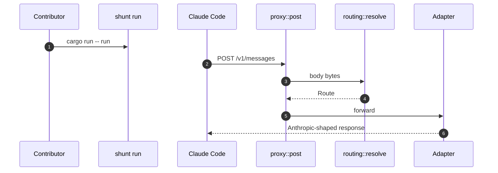
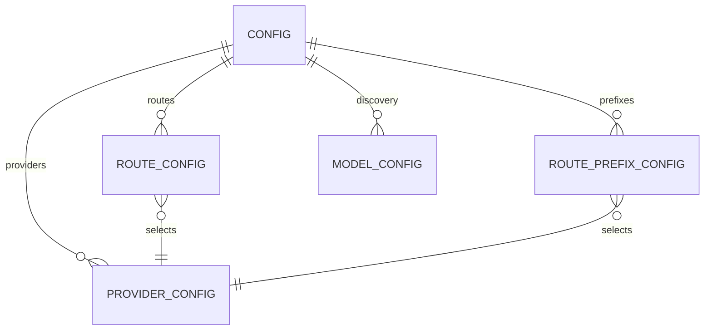

## Part I: Foundations

shunt is a Rust service. If you come from Python or JavaScript, think of the binary as an async web server plus a protocol translator. `tokio` is the event loop, Axum is the router, Reqwest is the outbound HTTP client, Serde owns JSON/TOML shape, and Figment merges configuration layers [Cargo.toml:1-23](https://github.com/chatbot-pf/shunt/blob/main/Cargo.toml#L1-L23) [src/server.rs:13-25](https://github.com/chatbot-pf/shunt/blob/main/src/server.rs#L13-L25) [src/config.rs:185-194](https://github.com/chatbot-pf/shunt/blob/main/src/config.rs#L185-L194).

| Rust concept | Python/JS analogy | Where shunt uses it | Source |
|---|---|---|---|
| `async fn` on Tokio | `async def` / `async function` under an event loop | `main`, `run`, proxy and adapter paths | [src/main.rs:38-76](https://github.com/chatbot-pf/shunt/blob/main/src/main.rs#L38-L76) [src/proxy.rs:19-126](https://github.com/chatbot-pf/shunt/blob/main/src/proxy.rs#L19-L126) |
| `Result<T, E>` | Exception-returning operation made explicit | Config loading, token refresh, adapter forwarding | [src/main.rs:77-83](https://github.com/chatbot-pf/shunt/blob/main/src/main.rs#L77-L83) [src/auth/codex_auth.rs:34-63](https://github.com/chatbot-pf/shunt/blob/main/src/auth/codex_auth.rs#L34-L63) |
| `enum` variants | Tagged unions | `ProviderKind`, `AuthMode`, `AdapterKind`, `Credential` | [src/config.rs:9-269](https://github.com/chatbot-pf/shunt/blob/main/src/config.rs#L9-L269) [src/routing.rs:37-89](https://github.com/chatbot-pf/shunt/blob/main/src/routing.rs#L37-L89) [src/auth/mod.rs:29-99](https://github.com/chatbot-pf/shunt/blob/main/src/auth/mod.rs#L29-L99) |
| Trait | Interface/protocol | `Adapter` abstracts provider protocol differences | [src/adapters/mod.rs:21-30](https://github.com/chatbot-pf/shunt/blob/main/src/adapters/mod.rs#L21-L30) |
| Serde derive | Pydantic/dataclass/TypeScript interface with parser | Config and gateway JSON structs | [src/config.rs:9-269](https://github.com/chatbot-pf/shunt/blob/main/src/config.rs#L9-L269) [src/discovery.rs:17-30](https://github.com/chatbot-pf/shunt/blob/main/src/discovery.rs#L17-L30) |

## Part II: This Codebase

shunt accepts Claude Code gateway requests and either forwards them to an Anthropic-compatible endpoint or translates them to OpenAI Responses. It does not run tools itself; it keeps Claude Code's tool loop intact by staying at the HTTP inference layer [README.md:1-60](https://github.com/chatbot-pf/shunt/blob/main/README.md#L1-L60) [docs/implementation-plan.md:46-71](https://github.com/chatbot-pf/shunt/blob/main/docs/implementation-plan.md#L46-L71).

```mermaid
graph TB
    CLI[main.rs CLI] --> Config[Config load and validation]
    Config --> Router[server.rs router]
    Router --> Proxy[proxy.rs post]
    Proxy --> Route[routing.rs resolve]
    Route --> Anthropic[AnthropicAdapter]
    Route --> Responses[ResponsesAdapter]
    Responses --> Req[responses_request.rs]
    Responses --> Sse[responses.rs state machine]
    classDef dark fill:#2d333b,stroke:#6d5dfc,color:#e6edf3;
    class CLI,Config,Router,Proxy,Route,Anthropic,Responses,Req,Sse dark;
    linkStyle default stroke:#8b949e;
```
<!-- Sources: src/main.rs:38, src/config.rs:185, src/server.rs:13, src/proxy.rs:19, src/routing.rs:37, src/adapters/responses.rs:34 -->

### Project Structure

| Path | Purpose | Why it matters | Source |
|---|---|---|---|
| `src/main.rs` | CLI and process lifecycle | Every local run starts here | [src/main.rs:38-76](https://github.com/chatbot-pf/shunt/blob/main/src/main.rs#L38-L76) |
| `src/server.rs` | Gateway HTTP surface | Defines supported endpoints | [src/server.rs:13-25](https://github.com/chatbot-pf/shunt/blob/main/src/server.rs#L13-L25) |
| `src/proxy.rs` | Request dispatch | Joins routing, adapters, and logging | [src/proxy.rs:19-126](https://github.com/chatbot-pf/shunt/blob/main/src/proxy.rs#L19-L126) |
| `src/config.rs` | Configuration schema and validation | Prevents invalid provider references | [src/config.rs:196-242](https://github.com/chatbot-pf/shunt/blob/main/src/config.rs#L196-L242) |
| `src/routing.rs` | Model-to-provider route resolution | Central selectivity mechanism | [src/routing.rs:37-89](https://github.com/chatbot-pf/shunt/blob/main/src/routing.rs#L37-L89) |
| `src/adapters/` | Protocol-specific outbound paths | Keeps pass-through separate from translation | [src/adapters/anthropic.rs:31-104](https://github.com/chatbot-pf/shunt/blob/main/src/adapters/anthropic.rs#L31-L104) [src/adapters/responses.rs:34-213](https://github.com/chatbot-pf/shunt/blob/main/src/adapters/responses.rs#L34-L213) |
| `src/model/` | Request and SSE translation | Load-bearing protocol conversion | [src/model/responses_request.rs:4-280](https://github.com/chatbot-pf/shunt/blob/main/src/model/responses_request.rs#L4-L280) [src/model/responses.rs:45-378](https://github.com/chatbot-pf/shunt/blob/main/src/model/responses.rs#L45-L378) |
| `src/auth/` | Credential lookup and refresh | Keeps provider secrets inside shunt | [src/auth/mod.rs:29-99](https://github.com/chatbot-pf/shunt/blob/main/src/auth/mod.rs#L29-L99) |
| `tests/` | Integration/protocol behavior tests | Protects gateway compatibility | [tests/passthrough.rs:72-247](https://github.com/chatbot-pf/shunt/blob/main/tests/passthrough.rs#L72-L247) [tests/responses_translate.rs:25-287](https://github.com/chatbot-pf/shunt/blob/main/tests/responses_translate.rs#L25-L287) |

### Core Request Lifecycle


<!-- Sources: src/main.rs:60, src/server.rs:23, src/proxy.rs:19, src/routing.rs:37, src/adapters/mod.rs:21 -->

### Data Model


<!-- Sources: src/config.rs:9, src/config.rs:25, src/config.rs:89, src/config.rs:97, src/config.rs:103 -->

### First Task Walkthrough

| Goal | Files to read first | Change pattern | Tests to run | Source |
|---|---|---|---|---|
| Add provider documentation | `shunt.toml.example`, `docs/running.md` | Add a provider table and route example | `cargo test` if code unchanged is optional; docs review required | [shunt.toml.example:1-134](https://github.com/chatbot-pf/shunt/blob/main/shunt.toml.example#L1-L134) [docs/running.md:1-461](https://github.com/chatbot-pf/shunt/blob/main/docs/running.md#L1-L461) |
| Add routing behavior | `src/routing.rs` | Extend resolver or route struct, then unit-test precedence | `cargo test routing` or full `cargo test` | [src/routing.rs:37-89](https://github.com/chatbot-pf/shunt/blob/main/src/routing.rs#L37-L89) |
| Add request conversion behavior | `src/model/responses_request.rs` | Add mapping helper and a focused test | `cargo test --test responses_translate` | [src/model/responses_request.rs:4-280](https://github.com/chatbot-pf/shunt/blob/main/src/model/responses_request.rs#L4-L280) [tests/responses_translate.rs:25-287](https://github.com/chatbot-pf/shunt/blob/main/tests/responses_translate.rs#L25-L287) |
| Add SSE conversion behavior | `src/model/responses.rs` | Update `AnthropicSseMachine` and event-sequence tests | `cargo test --test responses_translate` | [src/model/responses.rs:45-378](https://github.com/chatbot-pf/shunt/blob/main/src/model/responses.rs#L45-L378) [tests/responses_translate.rs:25-287](https://github.com/chatbot-pf/shunt/blob/main/tests/responses_translate.rs#L25-L287) |

## Part III: Getting Productive

| Tool | Version / source | Install / command | Expected output | Source |
|---|---|---|---|---|
| Rust stable | Cargo manifest edition 2021 | `rustup default stable` | stable toolchain active | [Cargo.toml:1-23](https://github.com/chatbot-pf/shunt/blob/main/Cargo.toml#L1-L23) |
| Cargo build | Rust toolchain | `cargo build` | debug binary compiles | [docs/running.md:1-461](https://github.com/chatbot-pf/shunt/blob/main/docs/running.md#L1-L461) |
| Config check | shunt binary | `cargo run -- check` | `config ok` | [src/main.rs:77-83](https://github.com/chatbot-pf/shunt/blob/main/src/main.rs#L77-L83) |
| Tests | Cargo + Wiremock | `cargo test` | all unit and integration tests pass | [.github/workflows/ci.yml:1-42](https://github.com/chatbot-pf/shunt/blob/main/.github/workflows/ci.yml#L1-L42) |
| Format | rustfmt | `cargo fmt --all --check` | no diff | [.github/workflows/ci.yml:1-42](https://github.com/chatbot-pf/shunt/blob/main/.github/workflows/ci.yml#L1-L42) |
| Lints | Clippy | `cargo clippy --all-targets --all-features -- -D warnings` | no warnings | [.github/workflows/ci.yml:1-42](https://github.com/chatbot-pf/shunt/blob/main/.github/workflows/ci.yml#L1-L42) |

### Development Workflow

```mermaid
flowchart LR
    Issue[Pick focused task] --> Branch[Worktree branch]
    Branch --> Read[Read docs + source]
    Read --> Change[Small code/doc change]
    Change --> Test[cargo fmt + clippy + test]
    Test --> PR[Open PR with checklist]
    PR --> Review[Review and iterate]
    classDef dark fill:#2d333b,stroke:#6d5dfc,color:#e6edf3;
    class Issue,Branch,Read,Change,Test,PR,Review dark;
    linkStyle default stroke:#8b949e;
```
<!-- Sources: CONTRIBUTING.md:1, .github/PULL_REQUEST_TEMPLATE.md:1, .github/workflows/ci.yml:35 -->

### Common Pitfalls

| Pitfall | Symptom | Avoid it by | Source |
|---|---|---|---|
| Treating shunt as an agent runtime | Looking for tool execution inside shunt | Remember shunt only changes inference HTTP routing | [README.md:1-60](https://github.com/chatbot-pf/shunt/blob/main/README.md#L1-L60) |
| Breaking streaming | Claude Code appears stalled | Preserve `Body::from_stream` and SSE event emission | [tests/passthrough.rs:72-247](https://github.com/chatbot-pf/shunt/blob/main/tests/passthrough.rs#L72-L247) |
| Dropping tool IDs | Tool results no longer match tool calls | Preserve `call_id` in request translation | [src/model/responses_request.rs:4-280](https://github.com/chatbot-pf/shunt/blob/main/src/model/responses_request.rs#L4-L280) [tests/responses_translate.rs:25-287](https://github.com/chatbot-pf/shunt/blob/main/tests/responses_translate.rs#L25-L287) |
| Assuming discovery shows `gpt-*` IDs | Model does not appear in `/model` | Use `ANTHROPIC_CUSTOM_MODEL_OPTION` or Claude-named aliases | [docs/running.md:189-393](https://github.com/chatbot-pf/shunt/blob/main/docs/running.md#L189-L393) |
| Storing provider keys in Claude Code | Secrets leak into wrong process boundary | Put provider credentials in shunt env/auth files | [src/auth/mod.rs:29-99](https://github.com/chatbot-pf/shunt/blob/main/src/auth/mod.rs#L29-L99) |

### Glossary

| Term | Meaning | Source |
|---|---|---|
| Gateway | HTTP server Claude Code talks to instead of Anthropic directly | [docs/implementation-plan.md:46-71](https://github.com/chatbot-pf/shunt/blob/main/docs/implementation-plan.md#L46-L71) |
| Provider | Named upstream service in `[providers.<name>]` | [src/config.rs:9-269](https://github.com/chatbot-pf/shunt/blob/main/src/config.rs#L9-L269) |
| Route | Exact model mapping to a provider | [src/routing.rs:37-89](https://github.com/chatbot-pf/shunt/blob/main/src/routing.rs#L37-L89) |
| Prefix route | Catch-all mapping by model prefix | [src/routing.rs:37-89](https://github.com/chatbot-pf/shunt/blob/main/src/routing.rs#L37-L89) |
| Default provider | Fallback provider for unmapped models | [src/config.rs:142-183](https://github.com/chatbot-pf/shunt/blob/main/src/config.rs#L142-L183) |
| Anthropic adapter | Pass-through protocol adapter | [src/adapters/anthropic.rs:31-104](https://github.com/chatbot-pf/shunt/blob/main/src/adapters/anthropic.rs#L31-L104) |
| Responses adapter | OpenAI Responses translation adapter | [src/adapters/responses.rs:34-213](https://github.com/chatbot-pf/shunt/blob/main/src/adapters/responses.rs#L34-L213) |
| Reasoning effort | Claude Code effort mapped to Responses reasoning effort | [src/model/responses_request.rs:75-98](https://github.com/chatbot-pf/shunt/blob/main/src/model/responses_request.rs#L75-L98) |
| Model discovery | `/v1/models` response consumed by Claude Code | [src/discovery.rs:17-30](https://github.com/chatbot-pf/shunt/blob/main/src/discovery.rs#L17-L30) |
| `apiKeyHelper` | Claude Code setting that can call `shunt token` | [src/auth/claude_auth.rs:27-92](https://github.com/chatbot-pf/shunt/blob/main/src/auth/claude_auth.rs#L27-L92) |
| ChatGPT OAuth | Codex login token source for ChatGPT-backed Responses | [src/auth/codex_auth.rs:34-63](https://github.com/chatbot-pf/shunt/blob/main/src/auth/codex_auth.rs#L34-L63) |
| SSE | Server-sent events streamed back to Claude Code | [src/model/responses.rs:45-378](https://github.com/chatbot-pf/shunt/blob/main/src/model/responses.rs#L45-L378) |

## Related Pages

| Page | Relationship |
|---|---|
| [Overview](../01-getting-started/overview.md) | Project overview |
| [Operations](../01-getting-started/operations.md) | Copy-paste run commands |
| [Architecture](../02-deep-dive/architecture.md) | Full internal map |
| [Testing and Quality](../02-deep-dive/testing-and-quality.md) | Validation strategy |
