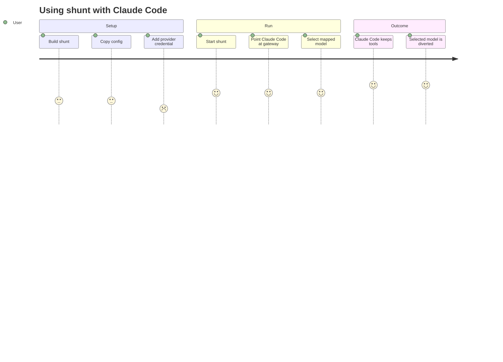
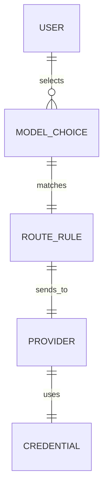

## What This System Does

shunt lets a Claude Code user choose that some conversations or agents use another model provider while everything else keeps working as normal in Claude Code. In plain terms, it is a switchboard: if the request names a configured model, shunt sends it to the configured provider; otherwise it lets it go to Anthropic [README.md:1-60](https://github.com/chatbot-pf/shunt/blob/main/README.md#L1-L60) [src/routing.rs:37-89](https://github.com/chatbot-pf/shunt/blob/main/src/routing.rs#L37-L89).

## User Journey


<!-- Sources: docs/running.md:438, docs/running.md:456, README.md:14 -->

## Feature Capability Map

| Feature | Status | User-facing behavior | Limitation | Source |
|---|---|---|---|---|
| Run local gateway | Live | User starts a local process | User must keep it running | [src/main.rs:38-76](https://github.com/chatbot-pf/shunt/blob/main/src/main.rs#L38-L76) [docs/running.md:1-461](https://github.com/chatbot-pf/shunt/blob/main/docs/running.md#L1-L461) |
| Choose model by ID | Live | User picks or configures a model name | Config must match the model string | [src/routing.rs:37-89](https://github.com/chatbot-pf/shunt/blob/main/src/routing.rs#L37-L89) [shunt.toml.example:1-134](https://github.com/chatbot-pf/shunt/blob/main/shunt.toml.example#L1-L134) |
| Keep normal Claude models | Live | Unmapped requests continue to Anthropic | Requires valid Anthropic credential | [src/adapters/anthropic.rs:31-104](https://github.com/chatbot-pf/shunt/blob/main/src/adapters/anthropic.rs#L31-L104) [docs/running.md:189-393](https://github.com/chatbot-pf/shunt/blob/main/docs/running.md#L189-L393) |
| Use OpenAI API key | Live | Mapped model can go to OpenAI | Requires `OPENAI_API_KEY` | [src/auth/mod.rs:29-99](https://github.com/chatbot-pf/shunt/blob/main/src/auth/mod.rs#L29-L99) [shunt.toml.example:1-134](https://github.com/chatbot-pf/shunt/blob/main/shunt.toml.example#L1-L134) |
| Use ChatGPT/Codex login | Live | Mapped model can use Codex backend | Requires `codex login` and entitled model | [src/auth/codex_auth.rs:34-63](https://github.com/chatbot-pf/shunt/blob/main/src/auth/codex_auth.rs#L34-L63) [docs/running.md:189-393](https://github.com/chatbot-pf/shunt/blob/main/docs/running.md#L189-L393) |
| Automatic model list | Partial | Claude-named aliases can appear in `/model` | `gpt-*` IDs are ignored by discovery | [src/discovery.rs:17-30](https://github.com/chatbot-pf/shunt/blob/main/src/discovery.rs#L17-L30) [docs/running.md:189-393](https://github.com/chatbot-pf/shunt/blob/main/docs/running.md#L189-L393) |

## Product Data Model


<!-- Sources: src/routing.rs:48, src/config.rs:89, src/config.rs:27, src/auth/mod.rs:17 -->

## Capability Flow

```mermaid
flowchart LR
    Request[Claude Code request] --> Model[Model name]
    Model --> Rule{Configured?}
    Rule -->|yes| Other[Other provider]
    Rule -->|no| Claude[Anthropic]
    Other --> Response[Claude Code response]
    Claude --> Response
    classDef dark fill:#2d333b,stroke:#6d5dfc,color:#e6edf3;
    class Request,Model,Rule,Other,Claude,Response dark;
    linkStyle default stroke:#8b949e;
```
<!-- Sources: README.md:4, src/routing.rs:48, src/adapters/anthropic.rs:31, src/adapters/responses.rs:34 -->

## Configuration and Controls

| Control | What it changes | Who can change it | Source |
|---|---|---|---|
| `server.bind` | Where shunt listens locally | Operator/developer | [shunt.toml.example:1-134](https://github.com/chatbot-pf/shunt/blob/main/shunt.toml.example#L1-L134) |
| `default_provider` | Where unmapped model requests go | Operator/developer | [src/config.rs:142-183](https://github.com/chatbot-pf/shunt/blob/main/src/config.rs#L142-L183) |
| `[[routes]]` | Exact model-to-provider mapping | Operator/developer | [src/routing.rs:37-89](https://github.com/chatbot-pf/shunt/blob/main/src/routing.rs#L37-L89) |
| `[[route_prefixes]]` | Broad model-prefix mapping | Operator/developer | [src/routing.rs:37-89](https://github.com/chatbot-pf/shunt/blob/main/src/routing.rs#L37-L89) |
| `ANTHROPIC_CUSTOM_MODEL_OPTION` | Adds a model choice in Claude Code | User | [docs/running.md:189-393](https://github.com/chatbot-pf/shunt/blob/main/docs/running.md#L189-L393) |
| Provider credentials | Enables access to provider | User/operator | [src/auth/mod.rs:29-99](https://github.com/chatbot-pf/shunt/blob/main/src/auth/mod.rs#L29-L99) |

## Known Limitations

| Limitation | User impact | Workaround | Source |
|---|---|---|---|
| Discovery does not show most `gpt-*` names | User may not see expected model in picker | Use custom model option or Claude-named alias | [docs/running.md:189-393](https://github.com/chatbot-pf/shunt/blob/main/docs/running.md#L189-L393) |
| Unsupported Codex model slug fails | Request returns provider error | Use an entitled slug or route alias | [docs/running.md:189-393](https://github.com/chatbot-pf/shunt/blob/main/docs/running.md#L189-L393) |
| Gateway must be running | Claude Code cannot reach mapped route | Start shunt before Claude Code | [docs/running.md:1-461](https://github.com/chatbot-pf/shunt/blob/main/docs/running.md#L1-L461) |
| Private early project | API/UX may change | Follow docs and PR checklist | [README.md:1-60](https://github.com/chatbot-pf/shunt/blob/main/README.md#L1-L60) [.github/PULL_REQUEST_TEMPLATE.md:1-26](https://github.com/chatbot-pf/shunt/blob/main/.github/PULL_REQUEST_TEMPLATE.md#L1-L26) |

## Data and Privacy

| Data type | Where it goes | Retention | Source |
|---|---|---|---|
| Claude Code request body | Routed through local shunt to selected upstream | shunt is stateless by default | [src/proxy.rs:19-126](https://github.com/chatbot-pf/shunt/blob/main/src/proxy.rs#L19-L126) [docs/implementation-plan.md:6-249](https://github.com/chatbot-pf/shunt/blob/main/docs/implementation-plan.md#L6-L249) |
| Provider API key | shunt process environment or Codex auth file | Local machine | [src/auth/mod.rs:29-99](https://github.com/chatbot-pf/shunt/blob/main/src/auth/mod.rs#L29-L99) [src/auth/codex_auth.rs:34-63](https://github.com/chatbot-pf/shunt/blob/main/src/auth/codex_auth.rs#L34-L63) |
| ChatGPT OAuth token | `~/.codex/auth.json` | Local machine, refreshed by shunt when needed | [src/auth/codex_auth.rs:34-63](https://github.com/chatbot-pf/shunt/blob/main/src/auth/codex_auth.rs#L34-L63) |
| Claude OAuth token helper | `~/.claude/.credentials.json` or env override | Local machine | [src/auth/claude_auth.rs:27-92](https://github.com/chatbot-pf/shunt/blob/main/src/auth/claude_auth.rs#L27-L92) |

## FAQ

| Question | Answer | Source |
|---|---|---|
| Does shunt replace Claude Code? | No. Claude Code still runs the session; shunt only handles inference HTTP routing. | [README.md:1-60](https://github.com/chatbot-pf/shunt/blob/main/README.md#L1-L60) |
| Can only one model be diverted? | Yes. Exact routes can target one model ID. | [src/routing.rs:37-89](https://github.com/chatbot-pf/shunt/blob/main/src/routing.rs#L37-L89) |
| Can broad groups be diverted? | Yes. Prefix routes can catch names like `gpt-`. | [src/routing.rs:37-89](https://github.com/chatbot-pf/shunt/blob/main/src/routing.rs#L37-L89) |
| Do normal Claude models keep working? | Yes, if the default provider remains Anthropic and credentials are valid. | [src/adapters/anthropic.rs:31-104](https://github.com/chatbot-pf/shunt/blob/main/src/adapters/anthropic.rs#L31-L104) |
| Does it store prompts? | The implementation is stateless by default according to the plan. | [docs/implementation-plan.md:6-249](https://github.com/chatbot-pf/shunt/blob/main/docs/implementation-plan.md#L6-L249) |
| Why does my `gpt-*` model not appear? | Claude Code discovery ignores IDs that do not start with `claude` or `anthropic`. | [docs/running.md:189-393](https://github.com/chatbot-pf/shunt/blob/main/docs/running.md#L189-L393) |
| What credentials are needed? | Anthropic for pass-through plus provider credentials for mapped models. | [src/auth/mod.rs:29-99](https://github.com/chatbot-pf/shunt/blob/main/src/auth/mod.rs#L29-L99) |
| Is this production-ready? | It is early/private, with hardening listed as a roadmap milestone. | [README.md:1-60](https://github.com/chatbot-pf/shunt/blob/main/README.md#L1-L60) [docs/implementation-plan.md:6-249](https://github.com/chatbot-pf/shunt/blob/main/docs/implementation-plan.md#L6-L249) |
| How do we know translation works? | Tests cover request translation, SSE conversion, and errors. | [tests/responses_translate.rs:25-287](https://github.com/chatbot-pf/shunt/blob/main/tests/responses_translate.rs#L25-L287) |
| Who reports security issues? | Use the private security contact and process in `SECURITY.md`. | [SECURITY.md:1-38](https://github.com/chatbot-pf/shunt/blob/main/SECURITY.md#L1-L38) |

## Related Pages

| Page | Relationship |
|---|---|
| [Executive Guide](./executive-guide.md) | Strategic risk and investment view |
| [Overview](../01-getting-started/overview.md) | Technical overview with minimal jargon |
| [Configuration](../01-getting-started/configuration.md) | Details of switches and model mappings |
