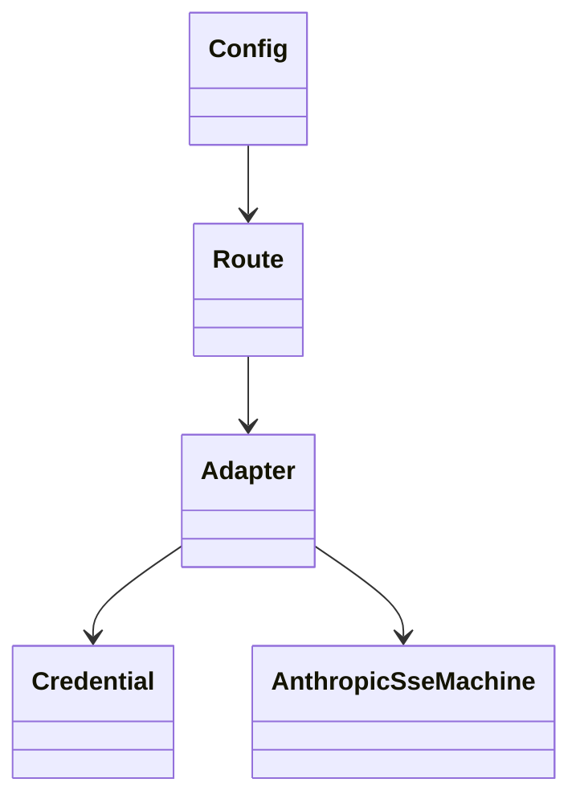
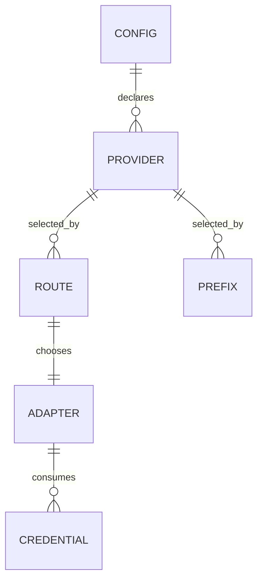
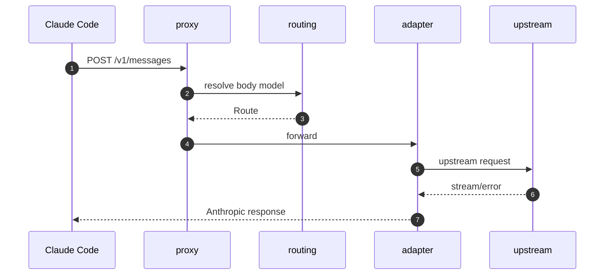
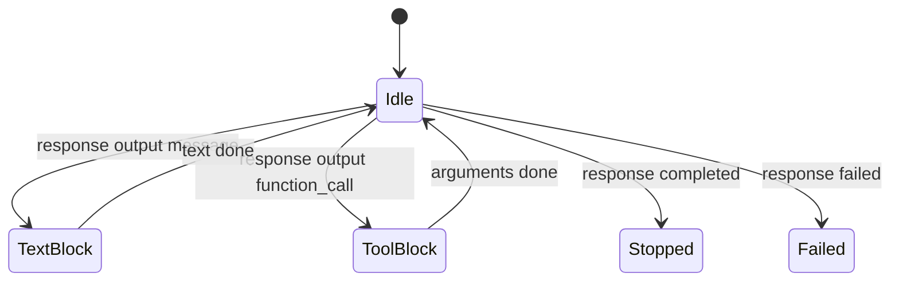

## Executive Summary

shunt owns one boundary: translating Claude Code's Anthropic-compatible gateway traffic into either pass-through Anthropic Messages traffic or OpenAI Responses traffic, selected by `model`. It delegates all agent behavior, tool execution, and UI/session orchestration back to Claude Code, which is why the gateway can be small, stateless, and testable [README.md:1-60](https://github.com/chatbot-pf/shunt/blob/main/README.md#L1-L60) [docs/implementation-plan.md:6-249](https://github.com/chatbot-pf/shunt/blob/main/docs/implementation-plan.md#L6-L249).

## Core Architectural Insight

The important decision is **route by model ID, not by agent identity**. In Python-like pseudocode:

```python
def handle_messages(request):
    route = resolve_model(config, request["model"])
    if route.adapter == "anthropic":
        return stream_passthrough(request, route)
    return stream_responses_translation(request, route)
```

That mirrors `routing::resolve_model` and `proxy::forward`: body bytes are parsed only for `model`, then a `Route` selects the adapter [src/routing.rs:37-89](https://github.com/chatbot-pf/shunt/blob/main/src/routing.rs#L37-L89) [src/proxy.rs:19-126](https://github.com/chatbot-pf/shunt/blob/main/src/proxy.rs#L19-L126).

```mermaid
graph TB
    Body[Request body bytes] --> Parse[Parse model only]
    Parse --> Resolve[Exact, prefix, default]
    Resolve --> Route[Route]
    Route --> A[Anthropic adapter]
    Route --> R[Responses adapter]
    classDef dark fill:#2d333b,stroke:#6d5dfc,color:#e6edf3;
    class Body,Parse,Resolve,Route,A,R dark;
    linkStyle default stroke:#8b949e;
```
<!-- Sources: src/proxy.rs:93, src/routing.rs:37, src/routing.rs:48, src/adapters/anthropic.rs:31, src/adapters/responses.rs:34 -->

## Architecture, Abstractions, and Invariants

| Abstraction | Why it is load-bearing | Failure if wrong | Source |
|---|---|---|---|
| `Config` | Makes providers and routes declarative | Adding providers would require code changes | [src/config.rs:9-269](https://github.com/chatbot-pf/shunt/blob/main/src/config.rs#L9-L269) |
| `Route` | Carries adapter, provider, upstream model, effort | Adapter cannot build correct outbound request | [src/routing.rs:37-89](https://github.com/chatbot-pf/shunt/blob/main/src/routing.rs#L37-L89) |
| `Adapter` trait | Separates protocol behavior from dispatch | Pass-through and translation logic would tangle | [src/adapters/mod.rs:21-30](https://github.com/chatbot-pf/shunt/blob/main/src/adapters/mod.rs#L21-L30) |
| `Credential` | Keeps auth strategy explicit | Provider secrets could leak or be omitted | [src/auth/mod.rs:29-99](https://github.com/chatbot-pf/shunt/blob/main/src/auth/mod.rs#L29-L99) |
| `AnthropicSseMachine` | Preserves Claude Code's expected stream protocol | Tool loop or UI streaming can break | [src/model/responses.rs:62-113](https://github.com/chatbot-pf/shunt/blob/main/src/model/responses.rs#L62-L113) |


<!-- Sources: src/config.rs:9, src/routing.rs:23, src/adapters/mod.rs:21, src/auth/mod.rs:17, src/model/responses.rs:24 -->

## Domain Model


<!-- Sources: src/config.rs:9, src/config.rs:25, src/routing.rs:23, src/routing.rs:68, src/auth/mod.rs:17 -->

| Decision | Alternatives considered | Rationale | Source |
|---|---|---|---|
| Use model routing | Prompt fingerprinting, global swap | Claude Code already chooses models per context | [docs/implementation-plan.md:6-249](https://github.com/chatbot-pf/shunt/blob/main/docs/implementation-plan.md#L6-L249) |
| Keep pass-through default | Translate every request | Unmapped Claude models should remain native | [README.md:1-60](https://github.com/chatbot-pf/shunt/blob/main/README.md#L1-L60) |
| Use Figment TOML/env config | Hardcoded providers | Operators can add providers without code | [src/config.rs:185-194](https://github.com/chatbot-pf/shunt/blob/main/src/config.rs#L185-L194) |
| Use Responses API only for OpenAI-family path | Chat Completions adapter | Codex/ChatGPT target speaks Responses | [docs/implementation-plan.md:6-249](https://github.com/chatbot-pf/shunt/blob/main/docs/implementation-plan.md#L6-L249) |
| Reuse Codex auth file | New OAuth flow first | Faster setup, matches `codex login` workflow | [src/auth/codex_auth.rs:34-63](https://github.com/chatbot-pf/shunt/blob/main/src/auth/codex_auth.rs#L34-L63) |

## Request Lifecycle


<!-- Sources: src/server.rs:23, src/proxy.rs:19, src/routing.rs:37, src/adapters/mod.rs:21, src/error.rs:77 -->

## Failure Modes

```mermaid
flowchart TB
    Req[Request] --> Parse{model JSON valid?}
    Parse -->|no| Bad[400 invalid_request_error]
    Parse -->|yes| Auth{credential available?}
    Auth -->|no| AuthErr[401 authentication_error]
    Auth -->|yes| Up[Upstream call]
    Up -->|transport error| Bg[502 api_error]
    Up -->|upstream 400/401/429| Map[Mapped Anthropic error]
    Up -->|ok| Stream[Stream response]
    classDef dark fill:#2d333b,stroke:#6d5dfc,color:#e6edf3;
    class Req,Parse,Bad,Auth,AuthErr,Up,Bg,Map,Stream dark;
    linkStyle default stroke:#8b949e;
```
<!-- Sources: src/routing.rs:37, src/auth/mod.rs:82, src/error.rs:40, src/adapters/responses.rs:128, src/proxy.rs:49 -->

## State Transitions


<!-- Sources: src/model/responses.rs:62, src/model/responses.rs:146, src/model/responses.rs:237, src/model/responses.rs:273, src/model/responses.rs:79 -->

## Risk and Debt

| Issue | Risk level | Business/technical impact | Source |
|---|---|---|---|
| `GET /protocol` not implemented in current router | Medium | Full gateway contract discoverability is deferred | [src/server.rs:13-25](https://github.com/chatbot-pf/shunt/blob/main/src/server.rs#L13-L25) [docs/implementation-plan.md:6-249](https://github.com/chatbot-pf/shunt/blob/main/docs/implementation-plan.md#L6-L249) |
| Token refresh writes credential files | Medium | Requires careful file permission and concurrency awareness | [src/auth/codex_auth.rs:34-63](https://github.com/chatbot-pf/shunt/blob/main/src/auth/codex_auth.rs#L34-L63) [src/auth/claude_auth.rs:27-92](https://github.com/chatbot-pf/shunt/blob/main/src/auth/claude_auth.rs#L27-L92) |
| Responses translation is stateful | High | Incorrect state transitions break streaming/tool use | [src/model/responses.rs:45-378](https://github.com/chatbot-pf/shunt/blob/main/src/model/responses.rs#L45-L378) [tests/responses_translate.rs:25-287](https://github.com/chatbot-pf/shunt/blob/main/tests/responses_translate.rs#L25-L287) |
| Discovery only works for Claude-prefixed aliases | Low | UX caveat, documented workaround exists | [src/discovery.rs:17-30](https://github.com/chatbot-pf/shunt/blob/main/src/discovery.rs#L17-L30) [docs/running.md:189-393](https://github.com/chatbot-pf/shunt/blob/main/docs/running.md#L189-L393) |

## Related Pages

| Page | Relationship |
|---|---|
| [Architecture](../02-deep-dive/architecture.md) | Full system map |
| [Adapters and Translation](../02-deep-dive/adapters-and-translation.md) | Translation internals |
| [Authentication](../02-deep-dive/authentication.md) | Trust boundaries |
| [Testing and Quality](../02-deep-dive/testing-and-quality.md) | Verification strategy |
